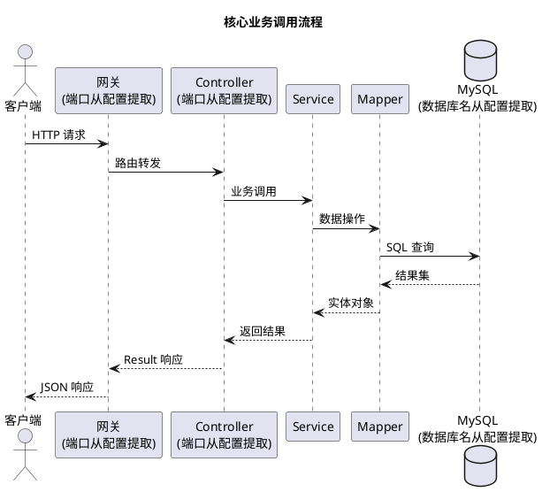
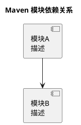
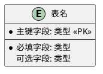
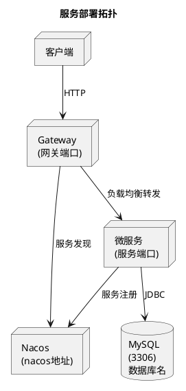

# Project Architecture Skill

当用户输入包含以下关键词时触发：重新构建项目文档、更新项目文档、更改技术架构、重新梳理技术架构。

## 执行流程

扫描项目后生成两份文档。先创建 `docx/` 目录，再依次生成。

### 第一步：扫描项目

并行执行以下扫描，获取所有信息后再开始写文档：

1. **模块结构** — 读取根 `pom.xml` 的 `<modules>`、`<properties>`、`<dependencyManagement>`
2. **各模块 pom.xml** — 依次读取每个子模块的 `pom.xml`，提取依赖
3. **Controller 文件** — 搜索所有 Controller 文件，提取 `@RestController`、`@RequestMapping`、`@GetMapping`、`@PostMapping`、`@PutMapping`、`@DeleteMapping` 注解信息
4. **配置文件** — 读取所有 `src/main/resources/application*.yml`
5. **SQL Schema** — 读取所有 `src/main/resources/**/*.sql`
6. **Bean/Entity** — 列出所有 `**/entity/**/*.java`、`**/dto/**/*.java`、`**/vo/**/*.java`，读取内容
7. **枚举** — 列出所有 `**/enums/**/*.java`、`**/enum/**/*.java`，读取内容
8. **工具类** — 列出所有 `**/utils/**/*.java`、`**/util/**/*.java`，读取内容
9. **安全/配置类** — 列出 CORS、Security、Filter 相关配置类，读取内容

### 第二步：生成 `docx/业务流程.md`

按以下模板逐章节写入：

---

# 业务流程

## 1. 项目概述

**项目名称：** {从根 pom.xml 的 `<artifactId>` 取值}
**简介：** {根据项目结构简述，1-2 句话}

## 2. 接口总览

按模块分组，列出所有 REST 接口：

| 模块 | 路径 | HTTP 方法 | 功能说明 |
|------|------|-----------|----------|
| ... | ... | ... | ... |

## 3. 接口详情

每个接口以三级标题列出，格式：

### HTTP方法 /路径 — 功能说明

**入参：**
| 参数 | 类型 | 必填 | 说明 |
|------|------|------|------|
| ... | ... | ... | ... |

**出参结构：**
| 字段 | 类型 | 说明 |
|------|------|------|
| ... | ... | ... |

**响应示例：**
```json
{ ... }
```

为每个接口填写以上信息，密码等敏感字段标注脱敏。

## 4. Bean / 实体说明

按模块分组，列出所有 Entity、DTO、VO：

### 实体：{EntityName}（{模块名}）

| 字段 | 类型 | 数据库列 | 说明 |
|------|------|----------|------|
| ... | ... | ... | ... |

继承自基类的字段一并列出。同时列出：

### 统一响应：Result<T> / 基础实体：BaseEntity

关键的公共 Bean 单独说明。

## 5. 枚举说明

列出所有枚举类。若扫描不到枚举类则标注"暂无"。

### 枚举：{EnumName}

| 枚举值 | 说明 |
|--------|------|
| ... | ... |

## 6. 工具类说明

列出所有工具类。若扫描不到则标注"暂无"。

### 工具类：{ClassName}

**路径：** `{package.path}`
**功能：** {简述}
**主要方法：**
| 方法 | 说明 |
|------|------|
| ... | ... |

## 7. 业务流程图

以 PlantUML 绘制核心业务流程的时序图，用 ` ```plantuml ` 代码块包裹。覆盖主要接口的调用链路：客户端 → 网关 → Controller → Service → Mapper → 数据库。



根据实际扫描到的 Controller 接口绘制准确的时序图，标注真实的路径和类名。

---

### 第三步：生成 `docx/技术架构.md`

按以下模板逐章节写入：

---

# 技术架构

## 1. 技术选型

| 类别 | 技术 | 版本 |
|------|------|------|
| 语言 | Java | {从 pom.xml 提取 java.version} |
| 框架 | Spring Boot | {从 parent 提取版本} |
| 微服务 | Spring Cloud | {从 properties 提取} |
| 服务发现 | Spring Cloud Alibaba Nacos | {从 properties 提取} |
| ORM | MyBatis-Plus | {从 properties 提取} |
| 数据库 | MySQL | 8.x |
| 网关 | Spring Cloud Gateway | Spring Cloud 内置 |
| 连接池 | HikariCP | Spring Boot 默认 |
| 工具 | Lombok | 全局依赖 |

版本号从 pom.xml 实际提取，无法确定的标注"默认"。

### 核心依赖

| 模块 | 核心依赖 |
|------|----------|
| ... | ... |

## 2. 模块结构

### 模块依赖关系



### 各模块职责

| 模块 | 类型 | 职责 |
|------|------|------|
| ... | library / application | ... |

## 3. 技术规范

### 代码规范

- **包结构：** {从项目扫描得出}
- **命名约定：** Controller 以 `Controller` 结尾，Service 接口以 `Service` 结尾，实现类以 `ServiceImpl` 结尾
- **注解约定：** 标注方式

### API 规范

- **统一响应：** 所有接口返回 `Result<T>`，包含 `code`、`message`、`data`
- **成功响应：** code=200
- **异常处理：** 通过 `BizException` + `GlobalExceptionHandler` 统一处理
- **REST 约定：** GET 查询，POST 创建，PUT 更新，DELETE 删除

### 数据库规范

- **表命名：** 小写字母，下划线分隔（项目实际约定）
- **字段命名：** 数据库 snake_case → Java camelCase（MyBatis-Plus 自动映射）
- **逻辑删除：** 使用 `deleted` 字段，0=未删除，1=已删除
- **自动填充：** `createTime` 插入时填充，`updateTime` 插入和更新时填充

## 4. 安全限制

| 安全项 | 当前实现 | 说明 |
|--------|----------|------|
| 认证 | {有/无} | {说明} |
| 鉴权 | {有/无} | {说明} |
| CORS | {配置情况} | {说明} |
| CSRF | {配置情况} | {说明} |
| 密码存储 | {加密方式} | **风险提示**（若为明文） |
| 日志脱敏 | {有/无} | {说明} |
| SQL 注入 | 低风险 / 需关注 | MyBatis-Plus 参数化查询默认安全，手写 SQL 需 Review |

根据实际扫描的安全配置诚实填写，对潜在风险明确标注。

## 5. 数据库设计

### 数据库信息

- **数据库名：** {从配置提取}
- **字符集：** {从建表脚本提取}

### 表结构

逐表列出：

| 字段 | 类型 | 约束 | 说明 |
|------|------|------|------|
| ... | ... | ... | ... |

### 索引

| 索引名 | 字段 | 类型 | 说明 |
|--------|------|------|------|
| ... | ... | ... | ... |

### ER 图



根据实际扫描的建表脚本绘制完整的 ER 图。

## 6. 配置说明

按服务分组，列出关键配置项：

### {服务名}（端口 {port}）

| 配置项 | 值 | 说明 |
|--------|-----|------|
| ... | ... | ... |

根据实际 application.yml 内容逐项列出。

## 7. 部署架构

### 服务拓扑



## 8. 部署方式与命令

### 环境要求

- **JDK:** {java.version}+
- **Maven:** 3.6+
- **MySQL:** 8.0+
- **Nacos:** 2.x（需预先启动）

### 构建命令

```bash
# 构建整个项目（跳过测试）
mvn clean package -DskipTests

# 构建单个模块
mvn clean package -pl {模块名} -DskipTests
```

### 启动命令

```bash
# 启动各可运行模块
java -jar {模块名}/target/{模块名}-{version}.jar
```

### 启动顺序

1. 启动 MySQL
2. 启动 Nacos
3. 初始化数据库（执行 schema.sql）
4. 启动业务服务
5. 启动网关

### 验证

```bash
# 确认服务注册到 Nacos
curl http://{nacos-addr}/nacos/v1/ns/instance/list?serviceName={serviceName}

# 通过网关访问接口
curl http://localhost:{gateway-port}/api/{path}
```

---

### 第四步：完成

生成完毕后，告知用户两份文档已生成到 `docx/` 目录。
