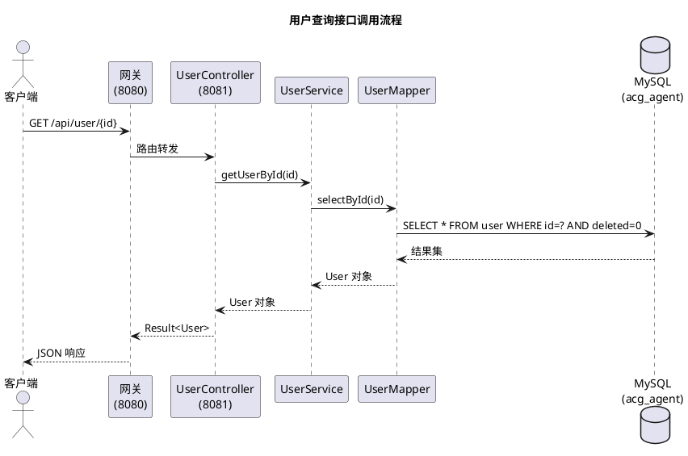
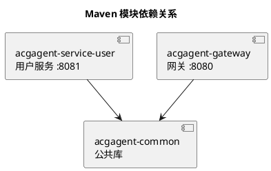
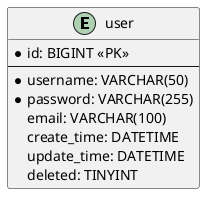
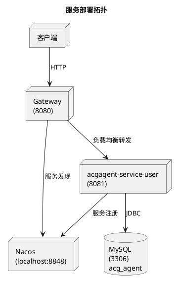

# Project Architecture Skill 实施计划

> **For agentic workers:** REQUIRED SUB-SKILL: Use superpowers:subagent-driven-development (recommended) or superpowers:executing-plans to implement this plan task-by-task. Steps use checkbox (`- [ ]`) syntax for tracking.

**Goal:** 创建 `.claude/skills/project-architecture.md`，用户触发后自动扫描项目并生成 `docx/业务流程.md` 和 `docx/技术架构.md`。

**Architecture:** 单个 skill 文件，包含触发条件描述和完整的分析指令 + 文档模板。Claude Code 通过 Skill 工具加载后，按指令执行代码扫描和文档生成。

**Tech Stack:** Claude Code Custom Skill（Markdown 文件，无代码依赖）

---

### Task 1: 创建 skills 目录并编写 skill 文件

**Files:**
- Create: `.claude/skills/project-architecture.md`

Skill 文件需要包含两部分：（1）Claude Code 可识别的 skill 元数据；（2）详细的执行指令和文档模板。

- [ ] **Step 1: 创建 `.claude/skills/` 目录**

```bash
mkdir -p .claude/skills
```

- [ ] **Step 2: 编写 skill 文件**

写入 `.claude/skills/project-architecture.md`：

```markdown
---
name: project-architecture
description: 当用户要求重新构建项目文档、更新项目文档、更改技术架构、重新梳理技术架构时使用此 skill。扫描整个项目代码，生成 docx/业务流程.md 和 docx/技术架构.md 两份文档。
---

# Project Architecture Skill

当用户输入包含以下关键词时触发：重新构建项目文档、更新项目文档、更改技术架构、重新梳理技术架构。

## 执行流程

扫描项目后生成两份文档。先创建 `docx/` 目录，再依次生成。

### 第一步：扫描项目

并行执行以下扫描，获取所有信息后再开始写文档：

1. **模块结构** — 读取根 `pom.xml` 的 `<modules>`、`<properties>`、`<dependencyManagement>`
2. **各模块 pom.xml** — 依次读取每个子模块的 `pom.xml`，提取依赖
3. **Controller 文件** — `grep "RestController\|@RequestMapping\|@GetMapping\|@PostMapping\|@PutMapping\|@DeleteMapping" **/*Controller.java` 提取接口
4. **配置文件** — 读取所有 `src/main/resources/application*.yml`
5. **SQL Schema** — 读取所有 `src/main/resources/**/*.sql`
6. **Bean/Entity** — 列出所有 `**/entity/**/*.java`、`**/dto/**/*.java`、`**/vo/**/*.java`，读取内容
7. **枚举** — 列出所有 `**/enums/**/*.java`，读取内容
8. **工具类** — 列出所有 `**/utils/**/*.java`、`**/util/**/*.java`，读取内容
9. **安全/配置类** — 列出 CORS、Security、Filter 相关配置类，读取内容

### 第二步：生成 `docx/业务流程.md`

按以下模板逐章节写入，代码块用 markdown fence 包裹：

---

# 业务流程

## 1. 项目概述

**项目名称：** {从根 pom.xml 的 `<artifactId>` 取值}
**简介：** {根据项目结构简述，1-2 句话}

## 2. 接口总览

按模块分组，列出所有 REST 接口：

| 模块 | 路径 | HTTP 方法 | 功能说明 |
|------|------|-----------|----------|
| {模块A} | /api/xxx | GET | 说明 |
| ... | ... | ... | ... |

## 3. 接口详情

每个接口以三级标题列出，格式：

### GET /api/user/{id} — 根据 ID 获取用户

**入参：**
| 参数 | 类型 | 必填 | 说明 |
|------|------|------|------|
| id | Long | 是 | 路径参数，用户 ID |

**出参：** `Result<User>`
| 字段 | 类型 | 说明 |
|------|------|------|
| code | Integer | 状态码 |
| message | String | 提示信息 |
| data.id | Long | 用户 ID |
| data.username | String | 用户名 |
| data.email | String | 邮箱 |
| data.createTime | LocalDateTime | 创建时间 |
| data.updateTime | LocalDateTime | 更新时间 |

**响应示例：**
```json
{
  "code": 200,
  "message": "success",
  "data": {
    "id": 1,
    "username": "admin",
    "password": "******",
    "email": "admin@example.com",
    "createTime": "2026-05-19T12:00:00",
    "updateTime": "2026-05-19T12:00:00"
  }
}
```

（为每个接口填写以上信息，密码字段标注脱敏）

## 4. Bean / 实体说明

按模块分组，列出所有 Entity、DTO、VO：

### 实体：User（acgagent-service-user）

| 字段 | 类型 | 数据库列 | 说明 |
|------|------|----------|------|
| id | Long | id | 主键，自增 |
| username | String | username | 用户名 |
| password | String | password | 密码（存储密文） |
| email | String | email | 邮箱 |
| createTime | LocalDateTime | create_time | 创建时间 |
| updateTime | LocalDateTime | update_time | 更新时间 |
| deleted | Integer | deleted | 逻辑删除 0/1 |

（继承自 BaseEntity 的字段一并列出）

### 基础实体：BaseEntity（acgagent-common）

| 字段 | 类型 | 数据库列 | 说明 |
|------|------|----------|------|
| id | Long | id | 主键，自增 |
| createTime | LocalDateTime | create_time | 创建时间（自动填充） |
| updateTime | LocalDateTime | update_time | 更新时间（自动填充） |
| deleted | Integer | deleted | 逻辑删除 0/1 |

### 统一响应：Result<T>（acgagent-common）

| 字段 | 类型 | 说明 |
|------|------|------|
| code | Integer | 状态码，200 表示成功 |
| message | String | 提示信息 |
| data | T | 泛型数据体，可为 null |

## 5. 枚举说明

列出所有枚举类（当前项目无枚举则标注"暂无"）。

（若扫描到枚举类，按以下格式填充：）

### 枚举：{EnumName}

| 枚举值 | 说明 |
|--------|------|
| ... | ... |

## 6. 工具类说明

列出所有工具类（当前项目无工具类则标注"暂无"）。

（若扫描到工具类，按以下格式填充：）

### 工具类：{ClassName}

**路径：** `{package.path}`
**功能：** {简述}
**主要方法：**
| 方法 | 说明 |
|------|------|
| ... | ... |

## 7. 业务流程图

以 PlantUML 绘制核心业务流程的时序图。用 ```plantuml 代码块包裹。



（为每个核心接口绘制时序图）

---

### 第三步：生成 `docx/技术架构.md`

按以下模板逐章节写入：

---

# 技术架构

## 1. 技术选型

| 类别 | 技术 | 版本 |
|------|------|------|
| 语言 | Java | {java.version} |
| 框架 | Spring Boot | {spring-boot.version} |
| 微服务 | Spring Cloud | {spring-cloud.version} |
| 服务发现 | Spring Cloud Alibaba Nacos | {spring-cloud-alibaba.version} |
| ORM | MyBatis-Plus | {mybatis-plus.version} |
| 数据库 | MySQL | 8.x |
| 网关 | Spring Cloud Gateway | {spring-cloud-gateway.version} |
| 连接池 | HikariCP | Spring Boot 默认 |
| 工具 | Lombok | {lombok.version} |

（版本号从 pom.xml 实际提取，无法确定的标注"默认"）

### 核心依赖

| 模块 | 核心依赖 |
|------|----------|
| acgagent-common | lombok, spring-boot-starter-web, jackson |
| acgagent-service-user | acgagent-common, spring-boot-starter-web, mybatis-plus, mysql-connector, nacos-discovery |
| acgagent-gateway | spring-cloud-starter-gateway, nacos-discovery, spring-cloud-loadbalancer |

## 2. 模块结构

### 模块依赖关系



### 各模块职责

| 模块 | 类型 | 职责 |
|------|------|------|
| acgagent-common | library | 公共基础：统一响应 Result、基础实体 BaseEntity、业务异常 BizException、全局异常处理 |
| acgagent-service-user | application | 用户 CRUD 服务，REST API |
| acgagent-gateway | application | API 网关，路由 `/api/user/**`，CORS |

## 3. 技术规范

### 代码规范

- **包结构：** `com.darkness.{模块}.{分层}`，分层包括 controller、service、service/impl、mapper、entity、config
- **命名约定：** Controller 以 `Controller` 结尾，Service 接口以 `Service` 结尾，实现类以 `ServiceImpl` 结尾，Entity 继承 `BaseEntity`
- **注解：** Controller 使用 `@RestController` + `@RequestMapping`，配置类使用 `@Configuration`

### API 规范

- **统一响应：** 所有接口返回 `Result<T>`，包含 `code`、`message`、`data`
- **成功响应：** `code=200, message="success"`
- **异常响应：** 业务异常通过 `BizException(code, message)` 抛出，由 `GlobalExceptionHandler` 统一捕获转换为 `Result<Void>`
- **REST 约定：** GET 查询，POST 创建，PUT 更新，DELETE 删除

### 数据库规范

- **表命名：** 小写字母，下划线分隔
- **字段命名：** 数据库使用 snake_case，Java 使用 camelCase（MyBatis-Plus 自动映射）
- **逻辑删除：** `deleted` 字段，0=未删除，1=已删除，MyBatis-Plus `@TableLogic` 自动处理
- **自动填充：** `createTime` 插入时填充，`updateTime` 插入和更新时填充

## 4. 安全限制

| 安全项 | 当前实现 | 说明 |
|--------|----------|------|
| 认证 | 无 | 当前无认证机制，后续需接入 Spring Security 或 OAuth2 |
| 鉴权 | 无 | 当前无角色/权限控制 |
| CORS | 允许所有来源 | CorsConfig 配置 `allowedOriginPatterns("*")`，生产环境需收紧 |
| CSRF | 无 | RESTful 无状态 API 通常无需 CSRF，但需注意 |
| 密码存储 | 明文存储 | **风险：当前密码字段未加密，需接入 BCrypt 或其他加密方式** |
| 日志脱敏 | 无 | 当前无敏感字段脱敏 |
| SQL 注入 | 低风险 | MyBatis-Plus 使用参数化查询，无手写 SQL |

## 5. 数据库设计

### 数据库信息

- **数据库名：** acg_agent
- **字符集：** utf8mb4

### 表结构：user

| 字段 | 类型 | 约束 | 说明 |
|------|------|------|------|
| id | BIGINT | PK, AUTO_INCREMENT | 主键 |
| username | VARCHAR(50) | NOT NULL | 用户名 |
| password | VARCHAR(255) | NOT NULL | 密码 |
| email | VARCHAR(100) | — | 邮箱 |
| create_time | DATETIME | DEFAULT CURRENT_TIMESTAMP | 创建时间 |
| update_time | DATETIME | DEFAULT CURRENT_TIMESTAMP ON UPDATE | 更新时间 |
| deleted | TINYINT | DEFAULT 0 | 逻辑删除 |

### 索引

| 索引名 | 字段 | 类型 | 说明 |
|--------|------|------|------|
| PRIMARY | id | 聚簇索引 | 主键 |

### ER 图



## 6. 配置说明

### 网关配置（acgagent-gateway，端口 8080）

| 配置项 | 值 | 说明 |
|--------|-----|------|
| server.port | 8080 | 网关监听端口 |
| spring.cloud.nacos.discovery.server-addr | localhost:8848 | Nacos 地址 |
| 路由 /api/user/** | lb://acgagent-service-user | 用户服务负载均衡 |

### 用户服务配置（acgagent-service-user，端口 8081）

| 配置项 | 值 | 说明 |
|--------|-----|------|
| server.port | 8081 | 服务端口 |
| spring.datasource.url | jdbc:mysql://localhost:3306/acg_agent | 数据库连接 |
| spring.datasource.driver-class-name | com.mysql.cj.jdbc.Driver | 驱动 |
| spring.cloud.nacos.discovery.server-addr | localhost:8848 | Nacos 地址 |
| mybatis-plus.configuration.map-underscore-to-camel-case | true | 驼峰映射 |
| mybatis-plus.global-config.db-config.logic-delete-field | deleted | 逻辑删除字段 |
| mybatis-plus.global-config.db-config.logic-delete-value | 1 | 已删除值 |
| mybatis-plus.global-config.db-config.logic-not-delete-value | 0 | 未删除值 |

## 7. 部署架构

### 服务拓扑



## 8. 部署方式与命令

### 环境要求

- **JDK:** 21+
- **Maven:** 3.6+
- **MySQL:** 8.0+
- **Nacos:** 2.x（需预先启动）

### 构建命令

```bash
# 构建整个项目（跳过测试）
mvn clean package -DskipTests

# 构建单个模块
mvn clean package -pl acgagent-service-user -DskipTests
```

### 启动命令

```bash
# 启动用户服务（8081）
java -jar acgagent-service-user/target/acgagent-service-user-1.0-SNAPSHOT.jar

# 启动网关（8080）
java -jar acgagent-gateway/target/acgagent-gateway-1.0-SNAPSHOT.jar
```

### 启动顺序

1. 启动 MySQL
2. 启动 Nacos
3. 初始化数据库：执行 `acgagent-service-user/src/main/resources/db/schema.sql`
4. 启动 acgagent-service-user
5. 启动 acgagent-gateway

### 验证

```bash
# 确认用户服务注册到 Nacos
curl http://localhost:8848/nacos/v1/ns/instance/list?serviceName=acgagent-service-user

# 通过网关访问用户接口
curl http://localhost:8080/api/user
```

---

### 第四步：提交变更

生成完毕后，提醒用户两份文档已生成到 `docx/` 目录。

## 使用方式

用户输入 `/project-architecture` 或说出触发关键词即可激活此 skill。
```

- [ ] **Step 3: 验证 skill 文件存在且路径正确**

```bash
ls -la .claude/skills/project-architecture.md
```

- [ ] **Step 4: 提交**

```bash
git add .claude/skills/project-architecture.md
git commit -m "$(cat <<'EOF'
feat: add project-architecture skill
EOF
)"
```
