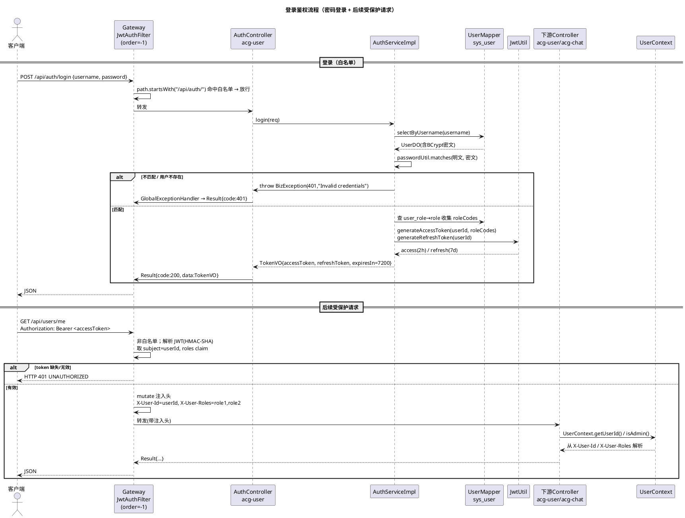
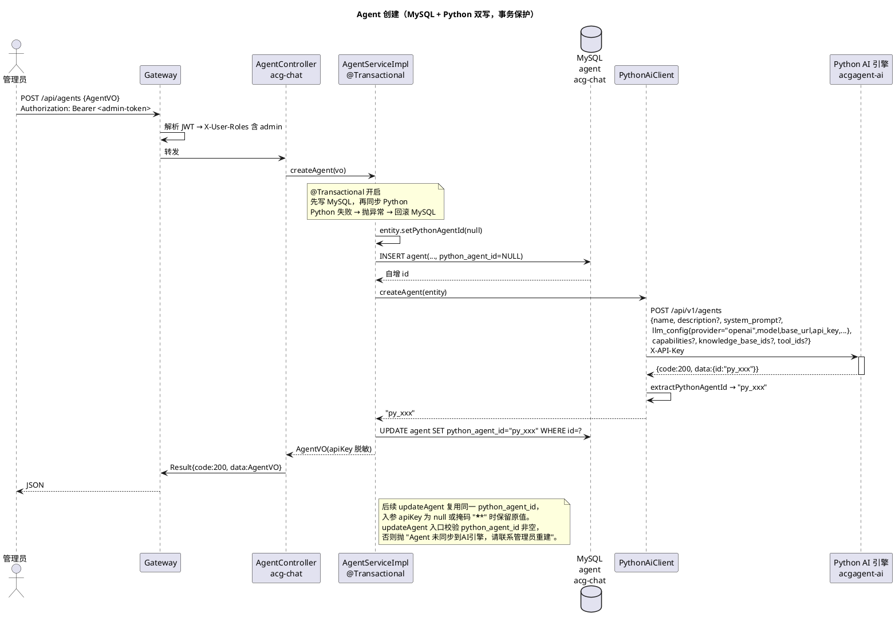

# 业务流程

> 本文档描述 acgAgent 项目当前的端到端业务流程，覆盖认证、RBAC、个人中心、Agent、对话、知识库/文档、工具、提示词模板等全部业务域。接口路径、字段、枚举值均以当前代码为准（实体 `*DO`、统一响应 `Result<T>`、业务异常 `BizException`、用户上下文 `UserContext`）。本文档不替代《前端对接指南.md》的字段级定义，只描述跨层流程与业务语义。

---

## 1. 项目概述

acgAgent 是基于 **Spring Boot 3.3.5 + Spring Cloud Alibaba 2023.0.3.2** 的 Java 21 微服务系统，由 Java 后端与 **外部 Python AI 引擎（acgagent-ai）** 共同承载业务，形成「双后端」架构：

- **Java 侧**（acg-gateway / acg-user / acg-chat）负责：网关鉴权、认证（密码/短信/微信）、RBAC、个人中心、Agent 配置存储、对话会话与消息持久化、提示词模板库。
- **Python 侧**（acgagent-ai，端口 8100）负责：大模型推理（SSE 流式）、Agent 运行时、**知识库/文档/工具的存储与执行**、提示词生成/审核/成本预估。

Java acg-chat 通过 `PythonAiClient`（WebClient）与 Python 引擎通信。**知识库/文档/工具由 Python 作为存储真相源，Java 不落库**；Agent 由 Java 落库并通过 `python_agent_id` 同步锚点与 Python 双向同步。因此知识库/文档/工具/Agent CUD/对话流式均依赖 Python 引擎在线，Python 不可用时这些业务域不可用。

**业务域清单：**

| # | 业务域 | 归属服务 | 是否走 Python 引擎 |
|---|--------|----------|--------------------|
| 1 | 认证（密码/短信/微信） | acg-user | 否 |
| 2 | RBAC（用户/角色/权限） | acg-user | 否 |
| 3 | 个人中心 | acg-user | 否 |
| 4 | Agent 管理 | acg-chat | 是（CUD 同步） |
| 5 | 对话（SSE 流式） | acg-chat | 是（流式推理） |
| 6 | 知识库 / 文档 | acg-chat | 是（纯代理） |
| 7 | 工具 | acg-chat | 是（纯代理） |
| 8 | 提示词模板 | acg-chat | 部分（generate/moderate/estimate 走 Python，模板 CRUD 落 MySQL） |

---

## 2. 公共能力

### 2.1 统一响应 `Result<T>`

所有 Controller 统一返回 `Result<T>`（`@JsonInclude(NON_NULL)`，data 为 null 时不序列化）。

| 字段 | 类型 | 说明 |
|------|------|------|
| `code` | `Integer` | 响应状态码，200 表示成功，其他值表示各类错误 |
| `message` | `String` | 响应描述信息，成功时为 `"success"`，失败时为具体错误描述 |
| `data` | `T` | 响应数据体，成功时携带业务数据，失败时为 null |

静态工厂方法：

| 方法 | 行为 |
|------|------|
| `Result.success(data)` | code=200，携带数据 |
| `Result.success()` | code=200，data=null |
| `Result.error(ResultCode, message)` | 携带枚举状态码 |
| `Result.error(code, message)` | 向后兼容（逐步废弃） |
| `Result.error(message)` | code=500（INTERNAL_ERROR） |

> 唯一例外：对话 SSE 发送接口（`POST /api/chat/conversations/{id}/send`）返回裸 `SseEmitter`，不包 `Result<T>`——长连接流无法套用统一信封。

### 2.2 业务异常 `BizException` 与 `GlobalExceptionHandler`

- `BizException(code, message)` 继承 `RuntimeException`，`code` 为 HTTP 风格状态码（404/403/401/400/500/503）。
- `GlobalExceptionHandler`（`@RestControllerAdvice`）统一捕获：
  - `BizException` → `Result.error(code, message)`，**HTTP 状态码保持 200**，语义错误码落在 body 的 `code`。
  - `MethodArgumentNotValidException`（参数校验失败）→ 聚合所有字段错误，分号分隔，body code=400。
  - 兜底 `Exception` → 记录日志，返回 `code=500 "Internal server error"`，不暴露堆栈。
- **Gateway 层例外**：`JwtAuthFilter` 在 token 缺失/无效时直接返回 **HTTP 401**（不经过 `Result` 信封）。

### 2.3 用户上下文 `UserContext`

下游服务通过 `UserContext`（`final` 工具类，从 `RequestContextHolder` 取当前请求）读取 Gateway 注入的身份头：

| 方法 | 读取的请求头 | 说明 |
|------|-------------|------|
| `getUserId()` | `X-User-Id` | 解析为 `Long`，缺失/空/非数字时返回 null |
| `getRoles()` | `X-User-Roles` | 逗号分隔的角色 code 集合，空时返回 `Set.of()` |
| `isAdmin()` | `X-User-Roles` | 集合中是否含 `"admin"` |
| `getUsername()` | `X-Username` | 用户名；头缺失时返回 null |

> Gateway 当前向下游注入的身份头为 `X-User-Id` 与 `X-User-Roles`，业务流程中下游服务据此完成鉴权与用户定位。

### 2.4 角色校验切面 `@RequireRole("admin")`

`RoleAuthAspect`（AOP `@Before`）拦截类或方法上的 `@RequireRole` 注解，读取 `X-User-Roles` 头与注解声明的角色取交集，交集为空时抛 `BizException(FORBIDDEN, "权限不足")`。本项目中 admin 专属接口均用此注解。

---

## 3. 认证域（acg-user）

所有 `/api/auth/**` 接口均为 **Gateway 白名单，无需认证**。三种登录方式均产出 **Access Token（2h）+ Refresh Token（7d）** 的 JWT 双令牌对。

> 配置依赖：JWT secret 与过期时间在 Nacos `common-jwt.yaml`，`jwt.secret` 无默认值，部署必须配置。

### 3.1 接口总览

| 方法 | 路径 | 认证 | 入参 | 出参 |
|------|------|------|------|------|
| POST | `/api/auth/register` | 无 | `RegisterRequest{username, password}`（均 `@NotBlank`） | `Result<UserVO>` |
| POST | `/api/auth/login` | 无 | `LoginRequest{username, password}` | `Result<TokenVO>` |
| POST | `/api/auth/refresh` | 无 | `RefreshTokenRequest{refreshToken}` | `Result<TokenVO>` |
| POST | `/api/auth/sms/send` | 无 | `SmsSendRequest{phone}` | `Result<Void>` |
| POST | `/api/auth/sms/login` | 无 | `SmsLoginRequest{phone, code}` | `Result<TokenVO>` |
| POST | `/api/auth/wx/qrcode` | 无 | 无 | `Result<Map<String,String>>`（`url`、`state`） |
| POST | `/api/auth/wx/callback` | 无 | `WxLoginRequest{code}` | `Result<TokenVO>` |

### 3.2 业务流程

**密码注册 / 登录**

- **注册**：校验用户名非空且唯一（重复抛 `BizException(400)`）→ BCrypt 加密明文密码 → 插入 `sys_user`（`status=ENABLED`、`nickname=username`）→ 绑定默认角色 `code="user"`（插入 `sys_user_role`）→ 返回 `UserVO`。
- **登录**：按用户名查 `sys_user`；用户不存在或 BCrypt `matches` 失败 → `BizException(401, "Invalid credentials")`；否则签发令牌对。
- **刷新**：校验 refreshToken 签名且类型为 `REFRESH`（否则 401），重新签发令牌对。
- **令牌生成**：查 `sys_user_role`→`sys_role` 收集 `roleCodes`，写入 JWT 的 `roles` claim；签发 Access(2h)+Refresh(7d) 双令牌。

**短信验证码登录（自动注册）**

1. 发送：`SmsServiceImpl.sendCode` 生成 **6 位数字**（`%06d`），插入 `sms_code` 记录（`used=UNUSED`、`expiredAt=now+5分钟`）。`sms.provider=mock`（默认）时仅日志打印 `[Mock SMS]`。
2. 登录：按 `(phone, code)` 查最新一条未使用且未过期的记录；不存在 → `BizException(401, "Invalid or expired verification code")`；标记 `used=USED`。
3. 按 `phone` 查用户：**未注册则自动创建**（`nickname="user_"+手机号后4位`、`status=ENABLED`、无密码、无角色绑定）；签发令牌对。

**微信扫码登录（OAuth2 自动绑定）**

1. 取二维码：`WxAuthServiceImpl.generateQrcode` 生成 `state`（UUID 去横线）拼装微信 `qrconnect` URL，返回 `{url, state}`。
2. 回调：前端拿到微信返回的 `code` 调 `/api/auth/wx/callback`。
   - 用 `code` 换 `access_token` + `openid`（调 `sns/oauth2/access_token`），`errcode` 非空 → `BizException(400, "WeChat auth failed: ...")`。
   - 调 `sns/userinfo` 取 `nickname`、`headimgurl`。
   - 按 `openid` 查 `wx_user`：已绑定复用 `userId`；**未绑定则自动创建系统用户 + 插入 `wx_user` 绑定**。
   - 签发令牌对。非 Biz 异常统一包装为 `BizException(500, "WeChat authentication failed")`。

---

## 4. RBAC 域（acg-user）

用户/角色/权限三表 + 两个关联表（`sys_user_role`、`sys_role_permission`）。

### 4.1 用户管理 `/api/users`（需登录，非 admin 限定）

| 方法 | 路径 | 入参 | 出参 |
|------|------|------|------|
| GET | `/api/users/me` | 无（取 `UserContext`） | `Result<UserVO>` |
| GET | `/api/users/{id}` | path `id` | `Result<UserVO>`（不存在 404） |
| GET | `/api/users` | 无 | `Result<List<UserVO>>` |
| POST | `/api/users` | `UserVO`（username/nickname/email/phone/avatar/status） | `Result<UserVO>` |
| PUT | `/api/users/{id}` | path `id` + `UserVO` | `Result<UserVO>` |
| DELETE | `/api/users/{id}` | path `id` | `Result<Void>`（逻辑删除） |
| POST | `/api/users/{userId}/roles` | path `userId` + body `List<Long> roleIds` | `Result<Void>`（替换语义：删旧插新） |
| GET | `/api/users/{userId}/roles` | path `userId` | `Result<List<Long>>` |

> 查询/更新/删除均经 `ServiceHelper.findOrThrow`，缺失抛 `BizException(NOT_FOUND)`。

### 4.2 角色管理 `/api/roles`（`@RequireRole("admin")`，admin 限定）

| 方法 | 路径 | 入参 | 出参 |
|------|------|------|------|
| GET | `/api/roles/{id}` | path `id` | `Result<RoleVO>` |
| GET | `/api/roles` | 无 | `Result<List<RoleVO>>` |
| POST | `/api/roles` | `RoleVO`（name、code 均 `@NotBlank`；sort、status、remark） | `Result<RoleVO>` |
| PUT | `/api/roles/{id}` | path `id` + `RoleVO` | `Result<RoleVO>` |
| DELETE | `/api/roles/{id}` | path `id` | `Result<Void>` |
| POST | `/api/roles/{roleId}/permissions` | path `roleId` + body `List<Long> permissionIds` | `Result<Void>`（替换语义） |
| GET | `/api/roles/{roleId}/permissions` | path `roleId` | `Result<List<PermissionVO>>` |

### 4.3 权限管理 `/api/permissions`（`@RequireRole("admin")`，admin 限定）

| 方法 | 路径 | 入参 | 出参 |
|------|------|------|------|
| GET | `/api/permissions/{id}` | path `id` | `Result<PermissionVO>` |
| GET | `/api/permissions` | 无 | `Result<List<PermissionVO>>`（扁平列表） |
| POST | `/api/permissions` | `PermissionVO`（name、code `@NotBlank`、`type` `@NotNull`、parentId 无校验[顶级权限可不传]、path、icon、sort、status） | `Result<PermissionVO>` |
| PUT | `/api/permissions/{id}` | path `id` + `PermissionVO` | `Result<PermissionVO>` |
| DELETE | `/api/permissions/{id}` | path `id` | `Result<Void>` |

权限为**树形结构**，`type` 取 `PermissionType` 枚举：`MENU(1,"菜单")` / `BUTTON(2,"按钮")`，父子关系由 `parentId` 表达。**列表接口返回扁平列表，树形组装由前端基于 `parentId`/`type` 完成。**

---

## 5. 个人中心域（acg-user）

`ProfileController`，基路径 `/api/user/profile`，**需登录**，所有操作均针对 `UserContext.getUserId()` 当前用户。

| 方法 | 路径 | 入参 | 出参 | 说明 |
|------|------|------|------|------|
| GET | `/api/user/profile/me` | 无 | `Result<UserVO>`（含 `roleCodes`、`permissionCodes`） | 4 表级联：user→user_role→role→role_permission→permission，去重后填充 |
| PUT | `/api/user/profile/me/profile` | `UpdateProfileRequest{nickname?, email?}` | `Result<UserVO>` | 部分更新，仅写非 null 字段 |
| PUT | `/api/user/profile/me/avatar` | multipart `file` | `Result<String>`（头像 URL） | `FileUploadUtil.saveFile`，更新 `sys_user.avatar` |
| PUT | `/api/user/profile/me/phone` | `ChangePhoneRequest{newPhone(11位), verifyCode}` | `Result<Void>` | 校验未使用的短信码并置 `USED`，校验新手机号未被他人占用 |
| PUT | `/api/user/profile/me/password` | `ChangePasswordRequest{oldPassword, newPassword(6-256), confirmPassword}` | `Result<Void>` | 校验两次新密码一致 + BCrypt 校验旧密码 + 编码新密码 |
| GET | `/api/user/profile/me/wx-status` | 无 | `Result<WxBindStatusVO>`（`bound`、脱敏 `openid`） | openid 脱敏为前2+`***`+后2（≤4 位则 `***`） |
| POST | `/api/user/profile/me/wx-unbind` | 无 | `Result<Void>` | 删除 `wx_user` 绑定；未绑定抛 `BizException(400, "未绑定微信账号")` |

> **路径差异提示（前端注意）**：`ProfileController` 基路径为 `/api/user/profile`（**单数** `user`），而 RBAC 用户管理基路径为 `/api/users`（**复数** `users`）。两者归属同一 acg-user 服务但不同 Controller，前端拼接时切勿混淆。

---

## 6. Agent 域（acg-chat）

Agent 是 LLM 调用配置实体，Java 为存储真相源，CUD 时经 `PythonAiClient` 同步到 Python。`AgentCategory` 分类：`CHAT("CHAT","对话")` / `VIDEO("VIDEO","视频")` / `IMAGE("IMAGE","生图")`（注意 value 为**大写**）。

### 6.1 接口总览 `/api/agents`

| 方法 | 路径 | 认证 | 入参 | 出参 |
|------|------|------|------|------|
| GET | `/api/agents` | **免认证**（Gateway 白名单） | 无 | `Result<List<AgentVO>>`（apiKey 脱敏） |
| GET | `/api/agents/{id}` | **免认证** | path `id` | `Result<AgentVO>`（不存在 404） |
| POST | `/api/agents` | **admin** | `AgentVO`（`@Valid`） | `Result<AgentVO>` |
| PUT | `/api/agents/{id}` | **admin** | path `id` + `AgentVO` | `Result<AgentVO>` |
| DELETE | `/api/agents/{id}` | **admin** | path `id` | `Result<Void>` |

### 6.2 业务流程（`AgentServiceImpl`）

所有 CUD 在单个 `@Transactional` 内执行：**先写 MySQL，再同步 Python，Python 失败则回滚 MySQL**，保证双端一致。

- **创建**：`entity.setPythonAgentId(null)` → 插入 MySQL → `pythonAiClient.createAgent(entity)`（`POST /api/v1/agents`，返回 Python 的 `data.id`）→ 回填 `python_agent_id` 列 → `updateById`。
- **更新**：
  - 前置校验：若现有 `python_agent_id` 为空 → 抛 `BizException(INTERNAL_ERROR, "Agent 未同步到 AI 引擎，请联系管理员重建")`。
  - 复用既有 `python_agent_id`。
  - 入参 `apiKey` 为 null 或等于掩码常量 `AgentConstants.API_KEY_MASK`（`"******"`）→ 保留原库值，否则覆盖。
  - 更新 MySQL → `pythonAiClient.updateAgent(...)`（`PUT /api/v1/agents/{agentId}`）。
- **删除**：先删 MySQL；若 `python_agent_id` 非空 → `pythonAiClient.deleteAgent(...)`（`DELETE /api/v1/agents/{agentId}`），失败回滚。

`python_agent_id` 是 Java↔Python 同步锚点：创建后由 Python 返回值写入，后续不可变；对话发送前以此非空作为「Agent 已同步」的判据。

### 6.3 存量同步（`AgentSyncMigrationRunner`）

`CommandLineRunner`，由配置项 `python-agent.migrate-existing`（默认 `false`）开关。开启时启动期扫描所有 `python_agent_id` 为空的 Agent，逐个调 `pythonAiClient.createAgent` 回填 id；**尽力而为**（单个失败仅记日志、不中断；已同步的跳过，幂等可重入）。新部署默认关闭，正常环境无需关注。

---

## 7. 对话域（acg-chat）

### 7.1 接口总览 `/api/chat`（需登录，按会话 owner 鉴权）

| 方法 | 路径 | 入参 | 出参 | 说明 |
|------|------|------|------|------|
| POST | `/api/chat/conversations` | `CreateConversationRequest{agentId(必填), title?}`（title 默认 `"New Conversation"`） | `Result<ConversationVO>` | 绑定当前用户与 Agent |
| GET | `/api/chat/conversations` | 无 | `Result<List<ConversationVO>>` | 当前用户会话，按 `createdAt` 倒序 |
| GET | `/api/chat/conversations/{id}/messages` | path `id` | `Result<List<MessageVO>>` | 会话所有权校验（防越权），按 `createdAt` 正序 |
| POST | `/api/chat/conversations/{id}/send` | path `id` + `SendMessageRequest{content}` | **`SseEmitter`**（非 `Result`） | SSE 流式发送 |
| DELETE | `/api/chat/conversations/{id}` | path `id` | `Result<Void>` | 所有权校验后逻辑删除，非 owner 抛 403 |

### 7.2 SSE 流式发送流程（`ChatServiceImpl.sendMessage`）

SSE 超时由 `chat.sse-timeout`（默认 `300000`ms = 5 分钟）配置，与 `PythonAiClient.streamReadTimeout` 对齐。流式处理跑在独立线程池（`Executors.newCachedThreadPool()`，`@PreDestroy` 优雅关闭）：

1. 校验会话所有权（非 owner 抛 403）。
2. 加载 Agent；若 `python_agent_id` 为空 → 抛 `BizException(INTERNAL_ERROR, "Agent 未同步到 AI 引擎，请联系管理员重建")`。
3. 持久化用户消息（`MessageRole.USER`，`"user"`）。
4. 创建 `SseEmitter(sseTimeout)`。
5. 异步调 `pythonAiClient.streamChat(pythonAgentId, conversationId, content, userId)` → `Flux<ChatEvent>`，订阅后：
   - `doOnNext`：每个 `ChatEvent` 序列化为 JSON `emitter.send(...)`；按 `event.getType()` 分流：
     - `"content"` → 追加 `event.getContent()` 到 `fullResponse` 累积器。
     - `"done"` → 把累积的完整回复作为助手消息（`MessageRole.ASSISTANT`）落库。
     - `"error"` → 置 `hadError` 标志（**不落库助手消息**）。
     - 其他（`tool_call`/`tool_result`/`thinking`）→ 仅透传前端，不落库。
   - `doOnComplete`：`hadError` 则 `emitter.completeWithError(...)`，否则 `emitter.complete()`。
   - `doOnError` → `emitter.completeWithError(...)`。

> 会话上下文由 Python 通过 `conversation_id` 维护（M1 阶段双写），Java **不回拉历史喂给 LLM**。

### 7.3 `ChatEvent` 结构（前端 SSE 解析契约）

`@JsonNaming(SnakeCaseStrategy.class)` + `@JsonIgnoreProperties(ignoreUnknown=true)`，对齐 Python `acgagent-ai` 的 ChatEvent（snake_case）：

| 字段 | 类型 | 携带于哪个事件 |
|------|------|----------------|
| `type` | `String` | 全部（`content`/`tool_call`/`tool_result`/`thinking`/`error`/`done`） |
| `content` | `String` | `content` / `thinking` |
| `toolName` | `String` | `tool_call` / `tool_result` |
| `toolInput` | `Map<String,Object>` | `tool_call` |
| `toolOutput` | `String` | `tool_result` |
| `code` | `Integer` | `error` |
| `message` | `String` | `error` / 状态信息 |
| `usage` | `Map<String,Object>` | `done`（token 用量） |

`MessageRole` 枚举仅 `USER("user")` / `ASSISTANT("assistant")`（**无 SYSTEM/tool 角色**）。

---

## 8. 知识库 / 文档域（acg-chat，纯代理 Python）

**Python 为知识库与文档的存储真相源，Java 不落库、不持有 Mapper。** `KnowledgeBaseServiceImpl` / `DocumentServiceImpl` 仅注入 `PythonAiClient`，每个 public 方法 1:1 转发。

### 8.1 知识库 `/api/knowledge-bases`（需登录 + admin）

| 方法 | 路径 | 入参 | 出参 |
|------|------|------|------|
| GET | `/api/knowledge-bases` | 无 | `Result<List<KnowledgeBaseVO>>` |
| GET | `/api/knowledge-bases/{id}` | path `id:String` | `Result<KnowledgeBaseVO>` |
| POST | `/api/knowledge-bases` | `KnowledgeBaseRequest`（name 必填） | `Result<KnowledgeBaseVO>` |
| PUT | `/api/knowledge-bases/{id}` | path `id` + `KnowledgeBaseRequest` | `Result<KnowledgeBaseVO>` |
| DELETE | `/api/knowledge-bases/{id}` | path `id` | `Result<Void>` |

### 8.2 文档 `/api/knowledge-bases/{kbId}/documents`（需登录 + admin）

| 方法 | 路径 | 入参 | 出参 | 说明 |
|------|------|------|------|------|
| POST | `/api/knowledge-bases/{kbId}/documents` | path `kbId` + **multipart `file`** | `Result<DocumentVO>`（`status="processing"`） | Python 异步处理 |
| GET | `/api/knowledge-bases/{kbId}/documents` | path `kbId` | `Result<List<DocumentVO>>` | 前端轮询状态 |
| GET | `/api/knowledge-bases/{kbId}/documents/{docId}` | path `kbId`,`docId` | `Result<DocumentVO>` | |
| DELETE | `/api/knowledge-bases/{kbId}/documents/{docId}` | path `kbId`,`docId` | `Result<Void>` | |

> 文档上传返回 `status=processing`，前端需轮询 GET 列表/详情观察处理结果（completed/failed 等）。

---

## 9. 工具域（acg-chat，纯代理 Python）

`ToolServiceImpl` 同样无本地持久化，1:1 转发 `PythonAiClient`。

### 9.1 接口 `/api/tools`（需登录 + admin）

| 方法 | 路径 | 入参 | 出参 | 说明 |
|------|------|------|------|------|
| GET | `/api/tools` | 无 | `Result<List<ToolVO>>` | 内置 + 自定义工具 |
| GET | `/api/tools/{id}` | path `id:String` | `Result<ToolVO>` | |
| POST | `/api/tools` | `ToolCreateRequest`（name、description 必填） | `Result<ToolVO>` | |
| DELETE | `/api/tools/{id}` | path `id` | `Result<Void>` | 内置工具不可删 |

> 内置工具 `calculator`、`web_search`、`knowledge_search` 不可删除，Python 删除时返回错误，Java 以 `BizException` 透传。**无 PUT/更新接口。**

---

## 10. 提示词模板域（acg-chat，混合）

混合本地 MySQL（`prompt_template` 表）与 Python 调用：

- **模板库 CRUD**：纯本地 MyBatis-Plus。公共模板 `user_id=NULL`（全员可见）；用户私有模板 `user_id=当前用户`。
- **generate/moderate/estimate**：转发 `PythonAiClient`。
- **apply-to-agent**：本地取模板 → 复用 `AgentService.updateAgent`（自带 Python 同步）。

`PromptMode` 枚举（value 为**小写**，匹配 Python `PromptMode(str, Enum)`）：`ACG("acg")`（二次元/动漫风格，仅挡暴力违法/超能力）/ `COMPLIANT("compliant")`（中性专业，额外限制二次元风格）。`@JsonCreator fromValue` 大小写不敏感，非法值抛 `IllegalArgumentException`（Controller 绑定转 HTTP 400）。

### 10.1 接口 `/api/prompts`（除 apply 外需登录）

| 方法 | 路径 | 认证 | 入参 | 出参 | 说明 |
|------|------|------|------|------|------|
| POST | `/api/prompts/generate` | 登录 | `PromptGenerateRequest{userHints, mode?, targetCapabilities?}` | 成功 `Result<PromptGenerateResponseVO>`；被审核拦截返回 `code=403,"blocked",data=ModerationVerdictVO` | 被 Python moderation 拦截时不落库；否则落库为当前用户私有模板，回填 `templateId` |
| POST | `/api/prompts/moderate` | 登录 | `PromptModerateRequest{systemPrompt}` | `Result<ModerationVerdictVO>` | 纯转发 |
| POST | `/api/prompts/estimate` | 登录 | `PromptEstimateRequest{systemPrompt, agentId?}` | `Result<CostEstimateVO>` | 纯转发 |
| GET | `/api/prompts/templates` | 登录 | query `mode?` | `Result<List<PromptTemplateVO>>` | 非 admin 见自己私有 + 全部公共（`userId=? OR userId IS NULL`）；admin 见全部；按 `createdAt` 倒序 |
| GET | `/api/prompts/templates/{id}` | 登录 | path `id` | `Result<PromptTemplateVO>` | 可见性校验：公共开放；私有仅 owner/admin |
| POST | `/api/prompts/templates` | 登录 | `PromptTemplateRequest{name, systemPrompt, isPublic?}` | `Result<PromptTemplateVO>` | `isPublic=true` 仅 admin，否则 403；公共 → `userId=NULL`，私有 → 当前用户 |
| PUT | `/api/prompts/templates/{id}` | 登录 | path `id` + `PromptTemplateRequest` | `Result<PromptTemplateVO>` | owner/admin 可写；admin 可翻转为公共 |
| DELETE | `/api/prompts/templates/{id}` | 登录 | path `id` | `Result<Void>` | owner/admin 可删 |
| POST | `/api/prompts/templates/{id}/apply/{agentId}` | **admin** | path `id`,`agentId` | `Result<Void>` | 取模板 systemPrompt → 复用 `AgentService.updateAgent` 同步 Python |

> **重要**：generate 被 moderation 拦截时 **HTTP 仍为 200**，错误码在 body 的 `code=403`，前端必须看 `code` 而非 HTTP 状态。自动命名取首条 hint 前 32 字符，兜底 `提示词-{mode}`。

---

## 11. 关键时序图

### 11.1 登录鉴权时序（Gateway JWT）



### 11.2 对话 SSE 流（含 Python 引擎节点）

```plantuml
@startuml
title 对话 SSE 流式发送（ChatServiceImpl → PythonAiClient → Python 引擎）
actor 客户端 as Client
participant "Gateway" as Gateway
participant "ChatController\nacg-chat" as ChatCtl
participant "ChatServiceImpl" as ChatSvc
database "MySQL\nconversation/message\nacg-chat" as DB
participant "AgentServiceImpl" as AgentSvc
participant "PythonAiClient\nWebClient" as PyClient
participant "Python AI 引擎\nacgagent-ai:8100" as Py
participant "SseEmitter" as Sse

Client -> Gateway: POST /api/chat/conversations/{id}/send\n{content}\nAuthorization: Bearer <token>
Gateway -> ChatCtl: 转发(注入 X-User-Id)
ChatCtl -> ChatSvc: sendMessage(userId, id, content)

ChatSvc -> DB: 校验会话 ownership(非owner→403)
ChatSvc -> AgentSvc: getAgentById(agentId)
AgentSvc --> ChatSvc: AgentVO(含 python_agent_id)
alt python_agent_id 为空
    ChatSvc -> ChatCtl: throw BizException(500,"Agent 未同步到AI引擎")
else 非空
    ChatSvc -> DB: 持久化 USER 消息(user)
    ChatSvc -> Sse: new SseEmitter(sseTimeout=300000)
    ChatSvc --> ChatCtl: 返回 emitter(非 Result 信封)
    ChatCtl -> Gateway: 流式响应(text/event-stream)
    Gateway --> Client: SSE 连接建立

    note over ChatSvc: 异步线程池执行
    ChatSvc -> PyClient: streamChat(pythonAgentId, conversationId, content, userId)
    PyClient -> Py: POST /api/v1/chat/{agentId}/completions\n{conversation_id, message, stream:true}\nX-API-Key, X-User-Id
    activate Py
    Py --> PyClient: SSE: data:{type:"content",content:"你"}...
    loop 流式事件
        Py --> PyClient: data:{...ChatEvent...}
        PyClient --> ChatSvc: Flux<ChatEvent>
        ChatSvc -> Sse: send(ChatEvent JSON)
        Sse -> Gateway -> Client: 推送事件
        alt type==content
            ChatSvc -> ChatSvc: fullResponse.append(content)
        else type==done
            ChatSvc -> DB: 持久化 ASSISTANT 消息(fullResponse)
        else type==error
            ChatSvc -> ChatSvc: hadError=true(不落库)
        else tool_call/tool_result/thinking
            ChatSvc -> Sse: 仅透传
        end
    end
    deactivate Py
    ChatSvc -> Sse: hadError? completeWithError : complete
    Sse -> Client: [DONE] 关闭连接
end
@enduml
```

### 11.3 Agent 创建 → 同步 Python



---

## 12. 枚举速查表

| 枚举 | 用途 | 常量（value） | 序列化/DB |
|------|------|--------------|-----------|
| `CommonStatus` | User/Role/Permission/Agent 的 status | `DISABLED(0)`、`ENABLED(1)` | int |
| `MessageRole` | MessageDO.role | `USER("user")`、`ASSISTANT("assistant")` | String，无 SYSTEM/tool |
| `AgentCategory` | Agent 分类 | `CHAT("CHAT")`、`VIDEO("VIDEO")`、`IMAGE("IMAGE")` | String **大写**；`fromValue` 非法时兜底 `CHAT` |
| `PromptMode` | 提示词生成模式 | `ACG("acg")`、`COMPLIANT("compliant")` | String **小写**，匹配 Python；`fromValue` 大小写不敏感，非法抛异常 |
| `PermissionType` | Permission.type | `MENU(1)`、`BUTTON(2)` | int |
| `TokenType` | JwtUtil 内部 | `ACCESS("access")`、`REFRESH("refresh")` | 纯枚举，无 `@JsonValue`（不入库/不外暴） |
| `UsedStatus` | SmsCodeDO.used | `UNUSED(0)`、`USED(1)` | int |
| `ResultCode` | 统一响应状态码 | `SUCCESS(200)`、`BAD_REQUEST(400)`、`UNAUTHORIZED(401)`、`FORBIDDEN(403)`、`NOT_FOUND(404)`、`INTERNAL_ERROR(500)`、`SERVICE_UNAVAILABLE(503)` | int |
