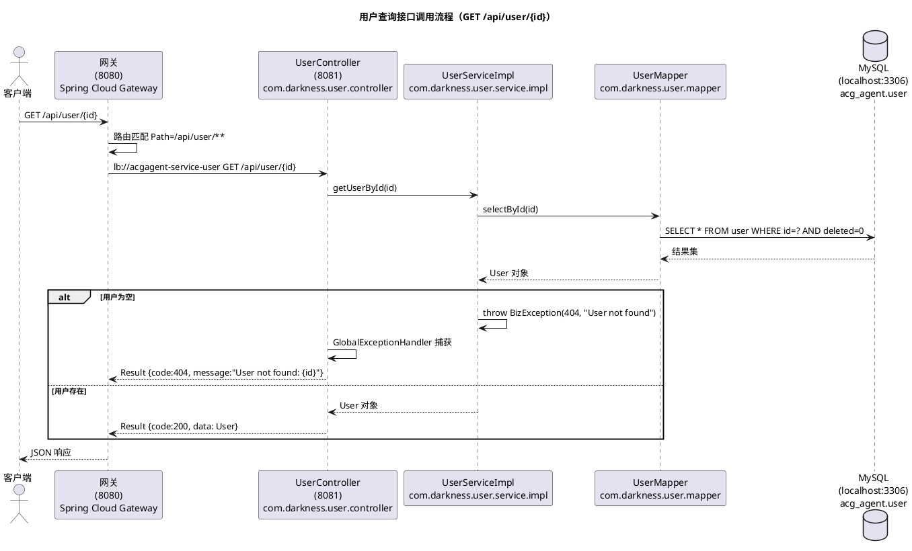
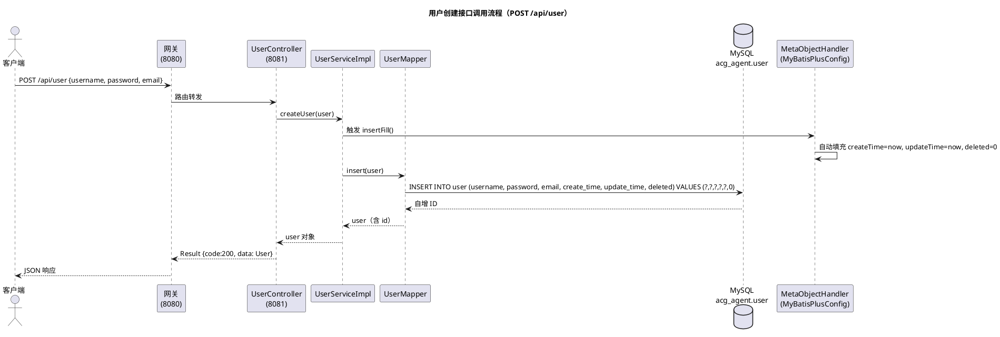
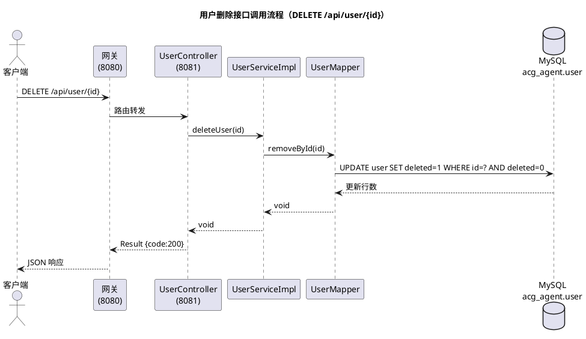

# 业务流程

## 1. 项目概述

**项目名称：** acgagent
**简介：** Spring Boot 3.3.5 + Spring Cloud 2023.0.3 微服务项目，提供用户 CRUD 服务，通过 Spring Cloud Gateway 统一入口，Nacos 服务发现，MyBatis-Plus 持久层。

## 2. 接口总览

| 模块 | 路径 | HTTP 方法 | 功能说明 |
|------|------|-----------|----------|
| acgagent-service-user | /api/user/{id} | GET | 根据 ID 查询用户 |
| acgagent-service-user | /api/user | GET | 查询所有用户列表 |
| acgagent-service-user | /api/user | POST | 创建用户 |
| acgagent-service-user | /api/user/{id} | PUT | 更新用户信息 |
| acgagent-service-user | /api/user/{id} | DELETE | 删除用户（逻辑删除） |

所有接口通过网关（8080）访问，网关将 `/api/user/**` 路由至 `acgagent-service-user`（8081）。

## 3. 接口详情

### GET /api/user/{id} — 根据 ID 获取用户

**入参：**
| 参数 | 类型 | 必填 | 说明 |
|------|------|------|------|
| id | Long | 是 | 路径参数，用户 ID |

**出参：** `Result<User>`
| 字段 | 类型 | 说明 |
|------|------|------|
| code | Integer | 状态码，200 表示成功 |
| message | String | 提示信息 |
| data.id | Long | 用户 ID |
| data.username | String | 用户名 |
| data.password | String | 密码 |
| data.email | String | 邮箱 |
| data.createTime | LocalDateTime | 创建时间 |
| data.updateTime | LocalDateTime | 更新时间 |

**响应示例：**
```json
{
  "code": 200,
  "message": "success",
  "data": {
    "id": 1,
    "username": "admin",
    "password": "******",
    "email": "admin@example.com",
    "createTime": "2026-05-19T12:00:00",
    "updateTime": "2026-05-19T12:00:00"
  }
}
```

用户不存在时返回：
```json
{
  "code": 404,
  "message": "User not found: 1"
}
```

---

### GET /api/user — 查询所有用户列表

**入参：** 无

**出参：** `Result<List<User>>`
| 字段 | 类型 | 说明 |
|------|------|------|
| code | Integer | 状态码 |
| message | String | 提示信息 |
| data[] | List\<User\> | 用户列表（字段同 GET /{id}） |

**响应示例：**
```json
{
  "code": 200,
  "message": "success",
  "data": [
    {
      "id": 1,
      "username": "admin",
      "password": "******",
      "email": "admin@example.com",
      "createTime": "2026-05-19T12:00:00",
      "updateTime": "2026-05-19T12:00:00"
    }
  ]
}
```

---

### POST /api/user — 创建用户

**入参：** JSON Body
| 参数 | 类型 | 必填 | 说明 |
|------|------|------|------|
| username | String | 是 | 用户名 |
| password | String | 是 | 密码（明文传输，建议前端加密） |
| email | String | 否 | 邮箱 |

**出参：** `Result<User>`
| 字段 | 类型 | 说明 |
|------|------|------|
| code | Integer | 状态码 |
| message | String | 提示信息 |
| data | User | 创建后的用户对象（含自动生成的 id、createTime） |

**请求示例：**
```json
{
  "username": "newuser",
  "password": "123456",
  "email": "new@example.com"
}
```

**响应示例：**
```json
{
  "code": 200,
  "message": "success",
  "data": {
    "id": 2,
    "username": "newuser",
    "password": "******",
    "email": "new@example.com",
    "createTime": "2026-05-19T12:30:00",
    "updateTime": "2026-05-19T12:30:00"
  }
}
```

---

### PUT /api/user/{id} — 更新用户信息

**入参：**
| 参数 | 类型 | 必填 | 说明 |
|------|------|------|------|
| id | Long | 是 | 路径参数，用户 ID |
| username | String | 否 | 请求体，用户名 |
| password | String | 否 | 请求体，密码 |
| email | String | 否 | 请求体，邮箱 |

**出参：** `Result<User>` — 更新后的用户对象

**请求示例：**
```json
{
  "username": "updatedname",
  "email": "updated@example.com"
}
```

**响应示例：**
```json
{
  "code": 200,
  "message": "success",
  "data": {
    "id": 1,
    "username": "updatedname",
    "password": "******",
    "email": "updated@example.com",
    "createTime": "2026-05-19T12:00:00",
    "updateTime": "2026-05-19T12:35:00"
  }
}
```

---

### DELETE /api/user/{id} — 删除用户

**入参：**
| 参数 | 类型 | 必填 | 说明 |
|------|------|------|------|
| id | Long | 是 | 路径参数，用户 ID |

**出参：** `Result<Void>` — 无 data 体

**响应示例：**
```json
{
  "code": 200,
  "message": "success"
}
```

## 4. Bean / 实体说明

### 实体：User（acgagent-service-user）

数据库表 `user`，继承 `BaseEntity`。

| 字段 | 类型 | 数据库列 | 说明 |
|------|------|----------|------|
| id | Long | id | 主键，自增（继承自 BaseEntity） |
| username | String | username | 用户名，NOT NULL |
| password | String | password | 密码（⚠ 当前明文存储） |
| email | String | email | 邮箱 |
| createTime | LocalDateTime | create_time | 创建时间（自动填充） |
| updateTime | LocalDateTime | update_time | 更新时间（自动填充） |
| deleted | Integer | deleted | 逻辑删除 0/1 |

### 基础实体：BaseEntity（acgagent-common）

| 字段 | 类型 | 数据库列 | 说明 |
|------|------|----------|------|
| id | Long | id | 主键，自增，`@TableId(type = IdType.AUTO)` |
| createTime | LocalDateTime | create_time | 插入时自动填充当前时间 |
| updateTime | LocalDateTime | update_time | 插入/更新时自动填充当前时间 |
| deleted | Integer | deleted | 逻辑删除标记，`@TableLogic`，0=未删除，1=已删除 |

### 统一响应：Result<T>（acgagent-common）

| 字段 | 类型 | 说明 |
|------|------|------|
| code | Integer | 状态码，200 成功，404 未找到，500 服务错误 |
| message | String | 提示信息 |
| data | T | 泛型数据体，`@JsonInclude(NON_NULL)`，为 null 时不序列化 |

静态方法：
| 方法 | 说明 |
|------|------|
| `Result.success(data)` | 成功响应，code=200，携带数据 |
| `Result.success()` | 成功响应，code=200，data=null |
| `Result.error(code, msg)` | 业务异常响应 |
| `Result.error(msg)` | 通用错误响应，code=500 |

### 业务异常：BizException（acgagent-common）

| 字段 | 类型 | 说明 |
|------|------|------|
| code | Integer | HTTP 风格状态码 |
| message | String | 异常描述（继承自 RuntimeException） |

## 5. 枚举说明

暂无。项目当前未定义枚举类。

## 6. 工具类说明

暂无。项目当前未定义独立工具类（公共能力通过 `Result`、`BaseEntity`、`BizException`、`GlobalExceptionHandler` 提供）。

## 7. 业务流程图

### 查询用户时序图



### 创建用户时序图



### 删除用户时序图


