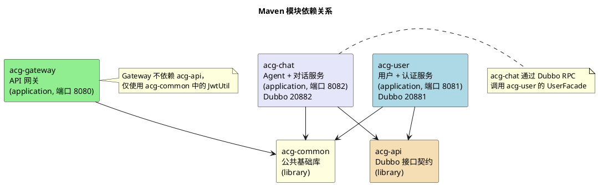
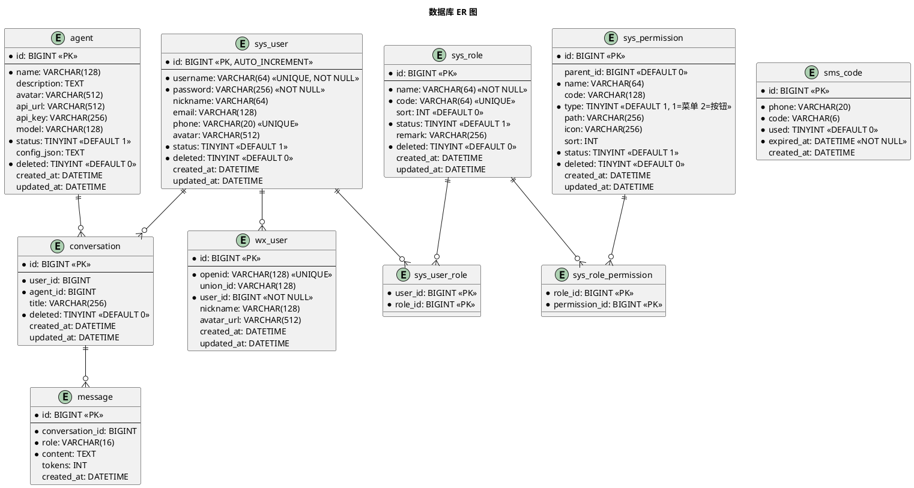
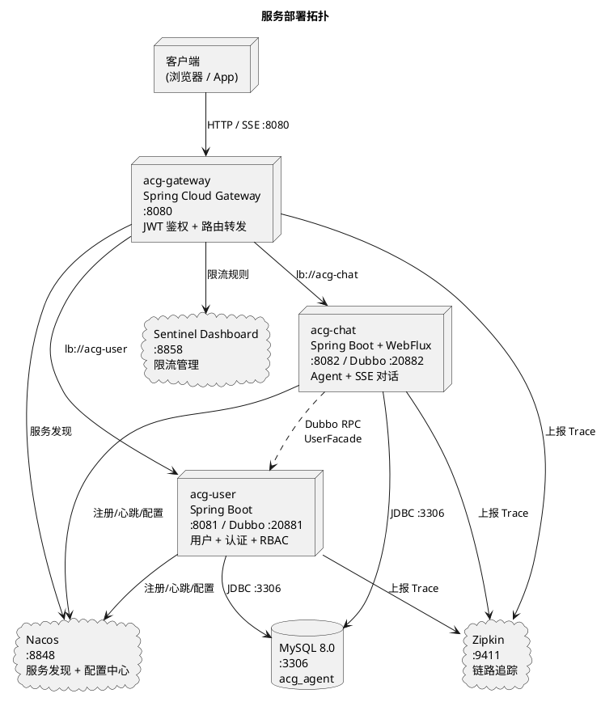

# 技术架构

## 1. 技术选型

| 类别 | 技术 | 版本 |
|------|------|------|
| 语言 | Java | 21 |
| 框架 | Spring Boot | 3.3.5 |
| 微服务 | Spring Cloud | 2023.0.3 |
| 服务治理 | Spring Cloud Alibaba | 2023.0.3.2 |
| RPC | Apache Dubbo | 3.3.2 |
| 服务发现/配置 | Nacos | 2.4.3 |
| 网关 | Spring Cloud Gateway | Spring Cloud 2023.0.3 内置 |
| ORM | MyBatis-Plus | 3.5.9 |
| 数据库 | MySQL | 8.0 |
| 连接池 | Druid | 1.2.23 |
| 认证 | JWT (jjwt) | 0.12.6 |
| 密码加密 | Spring Security Crypto (BCrypt) | Spring Boot 管理 |
| 流式通信 | Spring WebFlux (WebClient + SseEmitter) | Spring Boot 管理 |
| 链路追踪 | Micrometer Tracing + Zipkin | Spring Boot 管理 |
| 限流熔断 | Sentinel | Spring Cloud Alibaba 管理 |
| 部署 | Docker Compose | — |
| 工具 | Lombok | Spring Boot 父 POM 管理 |

### 核心依赖

| 模块 | 核心依赖 |
|------|----------|
| acg-common | lombok, spring-web, mybatis-plus-spring-boot3-starter, jjwt-api, jackson-annotations, spring-boot-starter-validation |
| acg-api | acg-common, lombok |
| acg-gateway | acg-common, spring-cloud-starter-gateway, spring-cloud-starter-alibaba-nacos-discovery/config, spring-cloud-starter-alibaba-sentinel, jjwt (api+impl+jackson), micrometer-tracing-bridge-brave, zipkin-reporter-brave |
| acg-user | acg-common, acg-api, spring-boot-starter-web, mybatis-plus-spring-boot3-starter, druid-spring-boot-3-starter, mysql-connector-j, spring-security-crypto, dubbo-spring-boot-starter, spring-cloud-starter-alibaba-nacos-discovery/config, spring-cloud-starter-alibaba-sentinel, micrometer-tracing-bridge-brave, zipkin-reporter-brave |
| acg-chat | acg-common, acg-api, spring-boot-starter-web, spring-boot-starter-webflux, mybatis-plus-spring-boot3-starter, druid-spring-boot-3-starter, mysql-connector-j, dubbo-spring-boot-starter, spring-cloud-starter-alibaba-nacos-discovery/config, spring-cloud-starter-alibaba-sentinel, micrometer-tracing-bridge-brave, zipkin-reporter-brave |

## 2. 模块结构

### 模块依赖关系



acg-user、acg-chat、acg-gateway 之间无编译期依赖。运行时通过 Dubbo RPC 和 Gateway HTTP 路由通信。

### 各模块职责

| 模块 | 类型 | 打包 | 端口 | 职责 |
|------|------|------|------|------|
| acg-common | library | jar | — | 公共基础：实体、Mapper、VO、枚举、常量、工具类（JwtUtil、UserContext、ServiceHelper）、统一响应 `Result<T>`、异常处理 `BizException` + `GlobalExceptionHandler` |
| acg-api | library | jar | — | Dubbo RPC 接口契约：`UserFacade`、`AgentFacade` 接口定义 + DTO（`UserDTO`、`AgentDTO`） |
| acg-gateway | application | jar | 8080 | API 网关：JWT 鉴权（GlobalFilter）、路由转发、CORS、Sentinel 限流 |
| acg-user | application | jar | 8081 / Dubbo 20881 | 用户管理 + RBAC + 认证（密码/短信/微信），Dubbo 服务提供者（`UserFacadeImpl`） |
| acg-chat | application | jar | 8082 / Dubbo 20882 | AI Agent 管理 + 对话 + SSE 流式聊天，Dubbo 服务提供者（`AgentFacadeImpl`） |

### 包结构

```
com.darkness
│
├── common                              # acg-common（com.darkness.common）
│   ├── entity/                         — 实体类
│   │   ├── BaseEntity                  — 基类（id, createdAt, updatedAt, deleted）
│   │   ├── UserDO                      — sys_user（username, password, phone, status）
│   │   ├── RoleDO                      — sys_role（RBAC 角色，code 唯一）
│   │   ├── PermissionDO                — sys_permission（树形权限，MENU/BUTTON）
│   │   ├── UserRoleDO                  — sys_user_role（用户-角色关联）
│   │   ├── RolePermissionDO            — sys_role_permission（角色-权限关联）
│   │   ├── AgentDO                     — agent（LLM 配置：apiUrl, apiKey, model）
│   │   ├── ConversationDO              — conversation（对话会话）
│   │   ├── MessageDO                   — message（对话消息，USER/ASSISTANT）
│   │   ├── SmsCodeDO                   — sms_code（短信验证码，6 位，5 分钟有效）
│   │   └── WxUserDO                    — wx_user（微信 openid 绑定）
│   ├── mapper/                         — MyBatis-Plus Mapper（11 个，继承 BaseMapper）
│   ├── model/                          — VO + Request DTO
│   │   ├── AgentVO, UserVO, RoleVO, PermissionVO, ConversationVO, MessageVO, TokenVO
│   │   └── LoginRequest, RegisterRequest, RefreshTokenRequest, CreateConversationRequest,
│   │       SendMessageRequest, SmsLoginRequest, SmsSendRequest, WxLoginRequest
│   ├── enums/                          — CommonStatus, MessageRole, PermissionType, TokenType, UsedStatus
│   ├── constant/                       — AgentConstants, AuthConstants, SseConstants
│   ├── result/                         — Result<T> + ResultCode
│   ├── exception/                      — BizException + GlobalExceptionHandler
│   └── util/                           — JwtUtil, UserContext, ServiceHelper
│
├── api                                 # acg-api（com.darkness.api）
│   ├── facade/
│   │   ├── AgentFacade                 — isAgentAvailable(Long)
│   │   └── UserFacade                  — getUserById(Long), listUsersByIds(List<Long>)
│   └── dto/
│       ├── AgentDTO                    — id, name, status
│       └── UserDTO                     — id, username, nickname, status
│
├── gateway                             # acg-gateway（com.darkness.gateway）
│   ├── GatewayApplication              — 启动类
│   ├── config/
│   │   └── CorsConfig                  — CORS 配置
│   └── filter/
│       └── JwtAuthFilter               — GlobalFilter，JWT 验证 + 白名单 + X-User-Id 注入
│
├── UserApplication                     # acg-user（com.darkness）
│   ├── auth/
│   │   ├── controller/AuthController   — 注册、登录、刷新 token、SMS、微信登录
│   │   ├── service/                    — AuthService, SmsService, WxAuthService
│   │   ├── service/impl/               — AuthServiceImpl, SmsServiceImpl, WxAuthServiceImpl
│   │   ├── util/PasswordUtil           — BCrypt 加密/验证
│   │   └── constant/WxApiConstants     — 微信 API 常量
│   ├── user/
│   │   ├── controller/                 — UserController, RoleController, PermissionController
│   │   ├── service/                    — UserService, RoleService, PermissionService
│   │   ├── service/impl/               — 对应实现类
│   │   └── dubbo/UserFacadeImpl        — @DubboService，UserFacade 实现
│   └── config/
│       ├── MyBatisPlusConfig           — MetaObjectHandler 自动填充
│       └── WxConfig                    — 微信配置
│
└── AgentApplication                    # acg-chat（com.darkness）
    ├── agent/
    │   ├── controller/                 — AgentController, ChatController
    │   ├── service/                    — AgentService, ChatService
    │   ├── service/impl/               — AgentServiceImpl, ChatServiceImpl
    │   ├── client/AgentClient          — WebClient SSE 流式调用 LLM API
    │   └── dubbo/AgentFacadeImpl       — @DubboService，AgentFacade 实现
    └── config/
        ├── MyBatisPlusConfig           — MetaObjectHandler 自动填充
        └── WebClientConfig             — WebClient Bean
```

## 3. 认证与安全架构

### 认证流程

系统采用 Gateway 统一鉴权模式，下游服务不再使用 Spring Security：

```
客户端 → Gateway(8080) → JwtAuthFilter → 验证 JWT → 注入 X-User-Id → 路由转发 → 下游服务
```

**详细流程：**

1. 客户端携带 `Authorization: Bearer <token>` 请求 Gateway
2. `JwtAuthFilter`（GlobalFilter，优先级 -1）拦截请求
3. 白名单路径直接放行：`/api/auth/**`、`/druid/**`、`GET /api/agents`、`GET /api/agents/{id}`
4. 非白名单请求解析 JWT（HMAC-SHA），提取 userId
5. 将 `X-User-Id` 和 `X-Username` 注入请求头，转发给下游服务
6. 下游服务通过 `UserContext.getUserId()` 从请求头读取当前用户 ID
7. Token 无效或缺失时返回 HTTP 401

**登录方式：**

| 方式 | 认证机制 | 说明 |
|------|----------|------|
| 用户名 + 密码 | JWT Token | BCrypt 密码校验，签发 Access + Refresh Token |
| 手机验证码 | JWT Token | 6 位验证码，5 分钟有效，未注册手机号自动注册 |
| 微信扫码 | OAuth2 + JWT | 微信开放平台授权回调后签发 Token，首次授权自动绑定/注册 |

**JWT Token 设计：**
- Access Token：有效期 2 小时，携带 userId
- Refresh Token：有效期 7 天，用于无感刷新 Access Token
- Token 签发在 acg-user 的 `JwtUtil`，验证在 acg-gateway 的 `JwtAuthFilter`

### 安全措施

| 安全项 | 实现方式 | 说明 |
|--------|----------|------|
| 认证 | Gateway JWT + JwtAuthFilter | 白名单外所有请求需携带 Bearer Token |
| 密码存储 | BCrypt（PasswordUtil） | 密码不可逆加密存储 |
| API Key 脱敏 | AgentVO.from() 中掩码 | Agent 的 apiKey 返回前端时显示为 `****` + 后 4 位 |
| CORS | CorsConfig 允许所有来源 | 开发阶段，生产环境需收紧 |
| SQL 注入防护 | MyBatis-Plus LambdaQueryWrapper | 参数化查询，禁止拼接 SQL |
| 输入校验 | Controller 层 + @Valid | 空值、格式、长度校验 |
| Sentinel 限流 | Gateway 路由级别限流 | 防止恶意请求 |

## 4. Dubbo RPC 接口

跨服务通信通过 Dubbo Triple 协议，注册到 Nacos：

| Facade 接口 | 提供者 | 方法 | 消费者 |
|---|---|---|---|
| `UserFacade` | acg-user (20881) | `getUserById(Long)` — 查询单个用户信息 | acg-chat |
| | | `listUsersByIds(List<Long>)` — 批量查询用户信息 | |
| `AgentFacade` | acg-chat (20882) | `isAgentAvailable(Long)` — 检查 Agent 是否可用 | 预留 |

**调用方式：** 消费者通过 `@DubboReference` 注入 Facade 接口，Dubbo 通过 Nacos 服务发现连接提供者。

## 5. SSE 流式通信

### 对话流式输出流程

Agent 生成回复时，后端通过 SSE 将生成内容逐字推送到前端：

```
前端 → POST /api/chat/conversations/{id}/send
     → ChatServiceImpl（acg-chat）
       → 保存用户消息到 message 表
       → 加载对话历史构建 LLM 上下文
       → 创建 SseEmitter（5 分钟超时）
       → 异步调用 AgentClient.stream()
         → WebClient POST 到 agent.apiUrl（OpenAI ChatCompletion 格式）
         → 解析 SSE data: 片段，提取 choices[0].delta.content
         → 通过 SseEmitter.send() 逐片转发前端
       → 流结束，保存 Assistant 消息到 message 表
```

**SSE 事件格式：**

| 事件 | 说明 |
|------|------|
| `data: {content}` | 携带生成的文本片段 |
| `data: [DONE]` | 标记流结束 |

Gateway 对 `/api/chat/**` 路径支持 SSE 流式转发（`Content-Type: text/event-stream`）。

## 6. 技术规范

### 代码规范

- **包结构：** `com.darkness.{模块}.{分层}`，分层包括 controller、service、service/impl、mapper、model、enums、constant、result、exception、util、client、dubbo、config
- **命名约定：** Controller 以 `Controller` 结尾，Service 接口以 `Service` 结尾，实现类以 `ServiceImpl` 结尾，Dubbo 实现以 `FacadeImpl` 结尾；启动类命名 `{模块}Application`
- **注解：** Controller 使用 `@RestController` + `@RequiredArgsConstructor` 构造注入，配置类使用 `@Configuration`
- **实体：** Entity 继承 `BaseEntity`，命名以 `DO` 后缀，使用 Lombok `@Data`，标注 `@TableName`
- **VO：** 命名以 `VO` 后缀，提供静态 `from(DO)` 工厂方法和 `toEntity()` 转换方法
- **注入：** 优先 Lombok `@RequiredArgsConstructor` 构造注入，禁止 `@Autowired` 字段注入

### API 规范

- **统一响应：** 所有接口返回 `Result<T>`（`code`、`message`、`data`）
- **成功码：** `code = 200`，`message = "success"`
- **异常处理：** 业务异常通过 `BizException(code, message)` 抛出 → `GlobalExceptionHandler` 捕获 → 返回 `Result<Void>`
- **REST 约定：** `GET` 查询 → `POST` 创建 → `PUT` 全量更新 → `DELETE` 逻辑删除
- **空值处理：** `Result.data` 为 null 时由 `@JsonInclude(NON_NULL)` 自动省略

### 数据库规范

- **表命名：** `sys_` 前缀表示系统表（`sys_user`、`sys_role`），业务表直接命名（`agent`、`conversation`）
- **字段命名：** 数据库 `snake_case` → Java `camelCase`，MyBatis-Plus 自动映射
- **主键：** `id BIGINT AUTO_INCREMENT`，实体使用 `@TableId(type = IdType.AUTO)`
- **逻辑删除：** `deleted` 字段（TINYINT，0=未删除，1=已删除），通过 `@TableLogic`
- **自动填充：** `created_at`（INSERT 填充），`updated_at`（INSERT + UPDATE 填充），由 `MetaObjectHandler` 处理
- **字符集：** `utf8mb4`

## 7. 数据库设计

### 数据库信息

- **数据库名：** `acg_agent`
- **字符集：** `utf8mb4`
- **引擎：** InnoDB
- **建表脚本：** `acg-user/src/main/resources/db/schema.sql`

### 表结构总览

| 表名 | 说明 | 核心字段 |
|------|------|----------|
| `sys_user` | 系统用户 | id, username(唯一), password, nickname, email, phone(唯一), avatar, status, deleted, created_at, updated_at |
| `sys_role` | 角色 | id, name, code(唯一), sort, status, remark, deleted, created_at, updated_at |
| `sys_permission` | 权限（树形） | id, parent_id, name, code, type(1=菜单/2=按钮), path, icon, sort, status, deleted, created_at, updated_at |
| `sys_user_role` | 用户-角色关联 | user_id, role_id（联合主键） |
| `sys_role_permission` | 角色-权限关联 | role_id, permission_id（联合主键） |
| `wx_user` | 微信用户绑定 | id, openid(唯一), union_id, user_id, nickname, avatar_url, created_at, updated_at |
| `sms_code` | 短信验证码 | id, phone, code(6位), used(0/1), expired_at, created_at |
| `agent` | AI Agent 配置 | id, name, description, avatar, api_url, api_key, model, status, config_json, deleted, created_at, updated_at |
| `conversation` | 对话会话 | id, user_id, agent_id, title, deleted, created_at, updated_at |
| `message` | 对话消息 | id, conversation_id, role(USER/ASSISTANT), content(TEXT), tokens, created_at |

### ER 图



## 8. 配置说明

### Gateway 路由配置

| 路由 ID | 目标服务 | 路径匹配 |
|---------|----------|----------|
| `user-service` | `lb://acg-user` | `/api/auth/**`, `/api/users/**`, `/api/roles/**`, `/api/permissions/**`, `/druid/**` |
| `agent-service` | `lb://acg-chat` | `/api/agents/**`, `/api/chat/**` |

### Nacos 配置管理

各服务通过 `bootstrap.yml` 从 Nacos（命名空间 `acg_agent`）拉取共享配置：

| 共享配置 | 内容 |
|----------|------|
| `common-mysql.yaml` | MySQL + Druid 连接池配置 |
| `common-dubbo.yaml` | Dubbo 协议与注册中心 |
| `common-jwt.yaml` | JWT secret 和过期时间 |

服务专属配置：`acg-user.yaml`、`acg-chat.yaml`、`acg-gateway.yaml`。

### acg-gateway（端口 8080）

| 配置项 | 值 | 说明 |
|--------|-----|------|
| `server.port` | 8080 | 网关监听端口 |
| `jwt.secret` | `${JWT_SECRET:默认值}` | HMAC-SHA256 密钥 |
| `zipkin.endpoint` | `${ZIPKIN_ENDPOINT:localhost:9411}` | 链路追踪端点 |
| `zipkin.sampling` | `${ZIPKIN_SAMPLING:1.0}` | 采样率 |

### acg-user（端口 8081 / Dubbo 20881）

| 配置项 | 值 | 说明 |
|--------|-----|------|
| `server.port` | 8081 | 服务端口 |
| `spring.datasource.url` | `${MYSQL_HOST:localhost}:3306/acg_agent` | 数据库连接 |
| `spring.datasource.password` | `${MYSQL_PASSWORD:root}` | 数据库密码 |
| `spring.datasource.type` | com.alibaba.druid.pool.DruidDataSource | Druid 连接池 |
| Druid 初始/最小/最大连接数 | 5 / 5 / 20 | 连接池大小 |
| Druid 慢 SQL 阈值 | 3000ms | 超时记录 |
| `jwt.access-token-expiration` | 7200000 (2h) | Access Token 有效期 |
| `jwt.refresh-token-expiration` | 604800000 (7d) | Refresh Token 有效期 |
| `wx.open.app-id` | `${WX_APP_ID:}` | 微信 AppID |
| `wx.open.app-secret` | `${WX_APP_SECRET:}` | 微信 AppSecret |
| `sms.provider` | `${SMS_PROVIDER:mock}` | 短信服务商 |
| `dubbo.protocol.port` | 20881 | Dubbo Triple 协议端口 |

### acg-chat（端口 8082 / Dubbo 20882）

| 配置项 | 值 | 说明 |
|--------|-----|------|
| `server.port` | 8082 | 服务端口 |
| 数据库配置 | 同 acg-user | 共享 acg_agent 库 |
| `dubbo.protocol.port` | 20882 | Dubbo Triple 协议端口 |
| `zipkin.endpoint` | `localhost:9411` | 链路追踪 |

## 9. 部署架构

### 服务拓扑



### 调用链路

```
客户端 → [HTTP] → Gateway(8080) → [lb://] → UserService(8081) → [JDBC] → MySQL(3306)
                   ↕ Nacos(8848)                                ↕ Dubbo RPC
                                        → [lb://] → AgentService(8082) → [JDBC] → MySQL(3306)
                                                                            ↕ WebClient
                                                               → [HTTP/SSE] → 外部 LLM API
```

## 10. Docker 部署

### Docker Compose 服务编排

`docker/docker-compose.yml` 定义 7 个服务：

| 服务 | 镜像 | 端口映射 | 依赖 |
|------|------|----------|------|
| `mysql` | `mysql:8.0` | 3306:3306 | — |
| `nacos` | `nacos/nacos-server:v2.4.3` | 8848:8848 | mysql (healthy) |
| `zipkin` | `openzipkin/zipkin:latest` | 9411:9411 | — |
| `sentinel-dashboard` | `bladex/sentinel-dashboard:1.8.8` | 8858:8858 | — |
| `acg-user` | 多阶段构建 (Dockerfile) | 8081:8081 | nacos, mysql |
| `acg-chat` | 多阶段构建 (Dockerfile) | 8082:8082 | nacos, mysql |
| `acg-gateway` | 多阶段构建 (Dockerfile) | 8080:8080 | nacos, acg-user, acg-chat |

**Dockerfile 构建方式：** 多阶段构建，Stage 1 使用 `eclipse-temurin:21-jdk` 编译，Stage 2 使用 `eclipse-temurin:21-jre` 运行。

**环境变量注入：**

| 变量 | 默认值 | 说明 |
|------|--------|------|
| `NACOS_ADDR` | `nacos:8848` | Nacos 地址 |
| `MYSQL_HOST` | `mysql` | MySQL 主机 |
| `MYSQL_PASSWORD` | `root` | MySQL 密码 |
| `JWT_SECRET` | 默认密钥 | JWT 签名密钥 |

### 启动顺序

1. MySQL（初始化 schema.sql）
2. Nacos（依赖 MySQL 就绪）
3. acg-user + acg-chat（并行启动，依赖 Nacos + MySQL）
4. acg-gateway（依赖 Nacos + acg-user + acg-chat）

### 构建与启动命令

```bash
# 构建整个项目
mvn clean package -DskipTests

# 启动全部服务
cd docker && docker-compose up -d

# 查看服务状态
docker-compose ps

# 查看日志
docker-compose logs -f acg-gateway
```

### 验证

```bash
# 检查 Nacos 服务注册
curl http://localhost:8848/nacos/v1/ns/instance/list?serviceName=acg-user

# 用户注册
curl -X POST http://localhost:8080/api/auth/register \
  -H "Content-Type: application/json" \
  -d '{"username":"admin","password":"123456"}'

# 用户登录
curl -X POST http://localhost:8080/api/auth/login \
  -H "Content-Type: application/json" \
  -d '{"username":"admin","password":"123456"}'

# 使用 Token 访问受保护接口
curl http://localhost:8080/api/users \
  -H "Authorization: Bearer <access_token>"

# 查看 Agent 列表（无需认证）
curl http://localhost:8080/api/agents

# Zipkin 链路追踪
open http://localhost:9411

# Sentinel 限流管理
open http://localhost:8858
```
