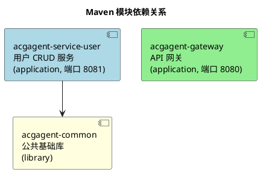
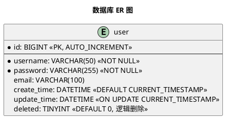
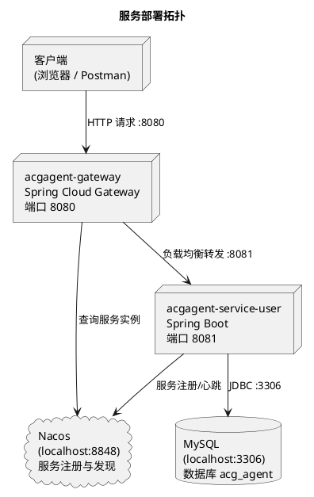

# 技术架构

## 1. 技术选型

| 类别 | 技术 | 版本 |
|------|------|------|
| 语言 | Java | 21 |
| 框架 | Spring Boot | 3.3.5 |
| 微服务 | Spring Cloud | 2023.0.3 |
| 服务发现 | Spring Cloud Alibaba Nacos | 2023.0.3.4 |
| ORM | MyBatis-Plus | 3.5.9 |
| 数据库 | MySQL | 8.0.33 |
| 网关 | Spring Cloud Gateway | Spring Cloud 2023.0.3 内置 |
| 连接池 | HikariCP | Spring Boot 默认 |
| 负载均衡 | Spring Cloud LoadBalancer | Spring Cloud 2023.0.3 内置 |
| 工具 | Lombok | Spring Boot 父 POM 管理 |

### 核心依赖

| 模块 | 核心依赖 |
|------|----------|
| acgagent-common | lombok, spring-boot-starter-web, mybatis-plus-spring-boot3-starter |
| acgagent-service-user | acgagent-common, spring-boot-starter-web, mybatis-plus-spring-boot3-starter, mysql-connector-j, spring-cloud-starter-alibaba-nacos-discovery |
| acgagent-gateway | spring-cloud-starter-gateway, spring-cloud-starter-alibaba-nacos-discovery, spring-cloud-starter-loadbalancer |

## 2. 模块结构

### 模块依赖关系



网关不直接依赖 common 模块，仅通过 Nacos 服务发现路由到 user 服务。

### 各模块职责

| 模块 | 类型 | 打包 | 职责 |
|------|------|------|------|
| acgagent-common | library | jar | 公共基础：统一响应 `Result<T>`、基础实体 `BaseEntity`、业务异常 `BizException`、全局异常处理 `GlobalExceptionHandler` |
| acgagent-service-user | application | jar (Spring Boot) | 用户 CRUD REST 服务，MyBatis-Plus 持久层，注册到 Nacos |
| acgagent-gateway | application | jar (Spring Boot) | API 网关，路由 `/api/user/**` 到 user 服务，CORS 配置，Nacos 服务发现 |

### 包结构

```
com.darkness
├── common                          # acgagent-common
│   ├── entity/BaseEntity.java
│   ├── result/Result.java
│   └── exception/
│       ├── BizException.java
│       └── GlobalExceptionHandler.java
├── user                            # acgagent-service-user
│   ├── UserServiceApplication.java
│   ├── controller/UserController.java
│   ├── service/
│   │   ├── UserService.java
│   │   └── impl/UserServiceImpl.java
│   ├── mapper/UserMapper.java
│   ├── entity/User.java
│   └── config/MyBatisPlusConfig.java
└── gateway                         # acgagent-gateway
    ├── GatewayApplication.java
    └── config/CorsConfig.java
```

## 3. 技术规范

### 代码规范

- **包结构：** `com.darkness.{模块}.{分层}`，分层包括 controller、service、service/impl、mapper、entity、config、result、exception
- **命名约定：** Controller 以 `Controller` 结尾，Service 接口以 `Service` 结尾，实现类以 `ServiceImpl` 结尾；启动类命名 `{模块}Application`
- **注解：** Controller 使用 `@RestController` + `@RequiredArgsConstructor` 构造注入，配置类使用 `@Configuration`
- **实体：** Entity 继承 `BaseEntity`，使用 Lombok `@Data`，标注 `@TableName`
- **注入：** 优先 Lombok `@RequiredArgsConstructor` 构造注入，避免 `@Autowired` 字段注入

### API 规范

- **统一响应：** 所有接口返回 `Result<T>`（`code`、`message`、`data`）
- **成功码：** `code = 200`，`message = "success"`
- **异常处理：** 业务异常通过 `BizException(code, message)` 抛出 → `GlobalExceptionHandler.handleBizException()` 捕获 → 返回 `Result<Void>`；未捕获异常由 `handleException()` 兜底，返回 `code=500`
- **REST 约定：** `GET` 查询 → `POST` 创建 → `PUT` 全量更新 → `DELETE` 逻辑删除（MyBatis-Plus `@TableLogic`）
- **空值处理：** `Result.data` 为 null 时由 `@JsonInclude(NON_NULL)` 自动省略

### 数据库规范

- **表命名：** 小写字母，下划线分隔（如 `user`）
- **字段命名：** 数据库 `snake_case` → Java `camelCase`，MyBatis-Plus 自动映射（`map-underscore-to-camel-case: true`）
- **主键：** `id BIGINT AUTO_INCREMENT`，实体使用 `@TableId(type = IdType.AUTO)`
- **逻辑删除：** `deleted` 字段（TINYINT，0=未删除，1=已删除），通过 `@TableLogic` 自动在 CRUD 中添加 `deleted=0` 条件，删除时执行 UPDATE 而非物理删除
- **自动填充：** `createTime`（`@TableField(fill = FieldFill.INSERT)`）插入时填充，`updateTime`（`@TableField(fill = FieldFill.INSERT_UPDATE)`）插入和更新时填充
- **字符集：** `utf8mb4`

## 4. 安全限制

| 安全项 | 当前实现 | 说明 |
|--------|----------|------|
| 认证 | 无 | 无任何认证机制，所有接口无需登录即可访问 |
| 鉴权 | 无 | 无角色/权限控制，所有用户拥有完全访问权限 |
| CORS | 允许所有来源 | `CorsConfig` 配置 `allowedOriginPatterns("*")`，允许所有方法/头，`allowCredentials=true`。生产环境需收紧为具体域名 |
| CSRF | 无防护 | RESTful 无状态 API 通常无需 CSRF，但 `allowCredentials=true` + 通配符 origin 组合存在安全风险 |
| 密码存储 | **明文存储**（高风险） | `user.password` 字段直接存储明文，无任何哈希或加密。需紧急接入 BCrypt / SCrypt |
| 密码传输 | 明文传输 | 无 HTTPS 配置，密码通过 HTTP 明文传输 |
| 日志脱敏 | 无 | MyBatis-Plus SQL 日志输出（`StdOutImpl`），可能泄露敏感数据 |
| SQL 注入 | 低风险 | MyBatis-Plus BaseMapper 使用参数化查询，无手写 SQL |
| 数据库密码 | 明文硬编码 | `application.yml` 中 `spring.datasource.password: root` 明文存储，建议使用环境变量或配置中心 |

## 5. 数据库设计

### 数据库信息

- **数据库名：** `acg_agent`
- **字符集：** `utf8mb4`
- **引擎：** InnoDB（MySQL 默认）

### 表结构：user

| 字段 | 类型 | 约束 | 说明 |
|------|------|------|------|
| id | BIGINT | PK, AUTO_INCREMENT | 主键 |
| username | VARCHAR(50) | NOT NULL | 用户名 |
| password | VARCHAR(255) | NOT NULL | 密码（⚠ 明文） |
| email | VARCHAR(100) | — | 邮箱 |
| create_time | DATETIME | DEFAULT CURRENT_TIMESTAMP | 创建时间 |
| update_time | DATETIME | DEFAULT CURRENT_TIMESTAMP ON UPDATE CURRENT_TIMESTAMP | 更新时间 |
| deleted | TINYINT | DEFAULT 0 | 逻辑删除标记 |

### 索引

| 索引名 | 字段 | 类型 | 说明 |
|--------|------|------|------|
| PRIMARY | id | 聚簇索引 | 主键 |

### 建表 DDL

```sql
CREATE DATABASE IF NOT EXISTS acg_agent DEFAULT CHARACTER SET utf8mb4;
USE acg_agent;
CREATE TABLE IF NOT EXISTS user (
    id BIGINT AUTO_INCREMENT PRIMARY KEY,
    username VARCHAR(50) NOT NULL,
    password VARCHAR(255) NOT NULL,
    email VARCHAR(100),
    create_time DATETIME DEFAULT CURRENT_TIMESTAMP,
    update_time DATETIME DEFAULT CURRENT_TIMESTAMP ON UPDATE CURRENT_TIMESTAMP,
    deleted TINYINT DEFAULT 0
);
```

### ER 图



## 6. 配置说明

### acgagent-gateway（端口 8080）

| 配置项 | 值 | 说明 |
|--------|-----|------|
| `server.port` | 8080 | 网关监听端口 |
| `spring.application.name` | acgagent-gateway | 服务名 |
| `spring.cloud.nacos.discovery.server-addr` | localhost:8848 | Nacos 注册中心地址 |
| `spring.cloud.gateway.discovery.locator.enabled` | true | 自动服务发现路由 |
| `spring.cloud.gateway.discovery.locator.lower-case-service-id` | true | 服务 ID 转为小写 |
| 路由 `/api/user/**` | `lb://acgagent-service-user` | 负载均衡转发到用户服务 |

### acgagent-service-user（端口 8081）

| 配置项 | 值 | 说明 |
|--------|-----|------|
| `server.port` | 8081 | 服务端口 |
| `spring.application.name` | acgagent-service-user | 服务名（注册到 Nacos） |
| `spring.datasource.driver-class-name` | com.mysql.cj.jdbc.Driver | MySQL 驱动 |
| `spring.datasource.url` | jdbc:mysql://localhost:3306/acg_agent | 数据库连接 |
| `spring.datasource.username` | root | 数据库用户名 |
| `spring.datasource.password` | root | 数据库密码（⚠ 明文） |
| `spring.cloud.nacos.discovery.server-addr` | localhost:8848 | Nacos 地址 |
| `mybatis-plus.configuration.map-underscore-to-camel-case` | true | 驼峰命名映射 |
| `mybatis-plus.configuration.log-impl` | StdOutImpl | SQL 日志输出到控制台 |
| `mybatis-plus.global-config.db-config.logic-delete-field` | deleted | 逻辑删除字段名 |
| `mybatis-plus.global-config.db-config.logic-delete-value` | 1 | 已删除标记值 |
| `mybatis-plus.global-config.db-config.logic-not-delete-value` | 0 | 未删除标记值 |

## 7. 部署架构

### 服务拓扑



### 调用链路

```
客户端 → [HTTP] → Gateway(8080) → [lb://] → UserService(8081) → [JDBC] → MySQL(3306)
                  ↕ Nacos(8848)
```

## 8. 部署方式与命令

### 环境要求

| 组件 | 版本要求 |
|------|----------|
| JDK | 21+ |
| Maven | 3.6+ |
| MySQL | 8.0+ |
| Nacos | 2.x（独立部署或 Docker） |

### 构建命令

```bash
# 构建整个项目（跳过测试）
mvn clean package -DskipTests

# 仅构建用户服务
mvn clean package -pl acgagent-service-user -DskipTests

# 仅构建网关
mvn clean package -pl acgagent-gateway -DskipTests
```

构建产物位于各模块的 `target/` 目录下，生成可执行 jar。

### 启动命令

```bash
# 启动用户服务（8081）
java -jar acgagent-service-user/target/acgagent-service-user-1.0-SNAPSHOT.jar

# 启动网关（8080）
java -jar acgagent-gateway/target/acgagent-gateway-1.0-SNAPSHOT.jar
```

### 启动顺序

1. 启动 MySQL（确保端口 3306 可连接）
2. 启动 Nacos（确保端口 8848 可访问）
3. 初始化数据库：执行 `acgagent-service-user/src/main/resources/db/schema.sql`
4. 启动 `acgagent-service-user`（注册到 Nacos）
5. 启动 `acgagent-gateway`

### 验证

```bash
# 确认用户服务已注册到 Nacos
curl http://localhost:8848/nacos/v1/ns/instance/list?serviceName=acgagent-service-user

# 通过网关访问用户列表接口
curl http://localhost:8080/api/user

# 通过网关查询单个用户
curl http://localhost:8080/api/user/1

# 通过网关创建用户
curl -X POST http://localhost:8080/api/user \
  -H "Content-Type: application/json" \
  -d '{"username":"test","password":"123456","email":"test@test.com"}'
```
